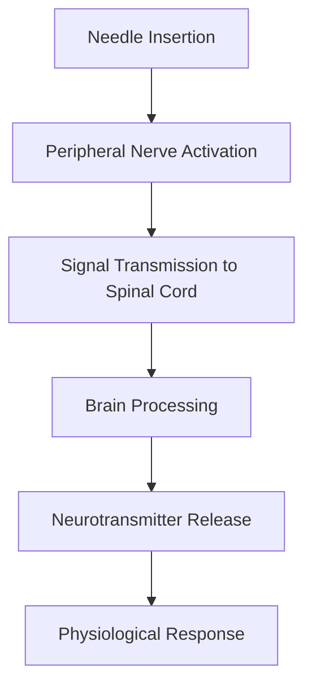
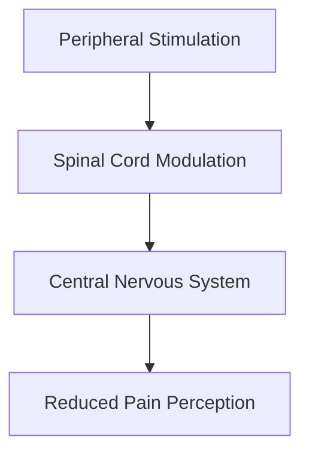

# 📘 **Neuropuncture – Structured Study Guide**

***

## 1. Executive Summary (Executive Audience)

*Neuropuncture* by Michael Corradino presents a modern, integrative framework that bridges **Traditional Chinese Medicine (TCM)** acupuncture with **contemporary neuroscience**. The central thesis is that acupuncture can be more accurately understood, applied, and clinically optimized by mapping acupuncture points and channels directly to **neuroanatomical structures**—including nerves, neurotransmitters, and functional brain systems.

Strategically, the book matters because it reframes acupuncture from a purely energetic or traditional paradigm into a **biomedical, evidence-aligned system**, making it more accessible to modern healthcare systems, integrative medicine practitioners, and scientific validation frameworks. It positions acupuncture as a **neuro-modulatory therapy**, aligning with current trends in pain management, mental health, and rehabilitation.

* **Publishing Year:** 2017 (commonly cited first edition)
* **Relevance:** Part of a growing movement integrating TCM with Western neuroscience for clinical precision and research acceptance

***

## 2. Key Concepts (Deep Study Notes)

### 🧠 1. Neuropuncture Framework

**Definition:**\
A system that maps acupuncture points and channels to **specific nerves, nerve pathways, and neurophysiological responses**.

**Explanation:**\
Instead of viewing acupuncture solely through Qi and meridians, Neuropuncture correlates:

* Acupuncture points → Peripheral nerves or nerve branches
* Channels → Functional neurological pathways

**Example:**

* Stimulation of a point on the forearm may correspond to activation of the **median nerve**, influencing sensory and motor pathways.

**Support to Thesis:**\
Provides the scientific bridge that validates acupuncture through **neurophysiology rather than metaphysical constructs**.

***

### ⚡ 2. Neurotransmitter Modulation

**Definition:**\
Acupuncture influences **neurochemical release** in the body.

**Explanation:**\
Needling specific points activates:

* Endorphins → Pain reduction
* Serotonin → Mood regulation
* Dopamine → Motivation and reward pathways

**Example:**

* Treating depression: selecting points that increase **serotonergic activity**

**Support to Thesis:**\
Positions acupuncture as a **neurochemical intervention tool**

***

### 🧬 3. Peripheral vs Central Nervous System Integration

**Definition:**\
Neuropuncture emphasizes how peripheral stimulation affects central processing.

**Explanation:**

* Peripheral nerves → Send signals to CNS
* CNS → Modulates pain, emotion, and autonomic function

**Example:**

* Needling activates A-delta and C-fibers → signals to spinal cord → brain interpretation

**Support to Thesis:**\
Explains acupuncture’s systemic effects using **known neural pathways**

***

### 🌿 4. Electroacupuncture as Neuromodulation

**Definition:**\
Application of electrical stimulation to needles to enhance neural effects.

**Explanation:**

* Frequency-dependent effects:
  * Low frequency → Endorphin release
  * High frequency → Enkephalin/dynorphin release

**Example:**

* Chronic pain treatment using alternating frequencies

**Support to Thesis:**\
Aligns acupuncture with **modern neuromodulation therapies**

***

### 🩺 5. Clinical Neuropuncture Protocols

**Definition:**\
Standardized treatment protocols based on neurological conditions.

**Explanation:**\
Includes protocols for:

* Pain syndromes
* Neurological disorders
* Mental health conditions

**Example:**

* Sciatica → Targeting nerve root pathways + local nerve stimulation

**Support to Thesis:**\
Demonstrates **practical applicability of neuroscience-integrated acupuncture**

***

## 3. Deep Study Notes

### 🔗 Integration of TCM and Neuroscience

Neuropuncture does not reject TCM—it **reinterprets it**.

* Meridians = Functional networks of nerve signaling
* Qi = Bioelectrical and biochemical signaling
* Acupuncture points = Neurovascular bundles

***

### 🔄 Mechanism of Action Flow

***

### 🧠 Pain Modulation Model

Acupuncture works through **three layers**:

1. Peripheral gating (local effect)
2. Spinal processing (signal filtering)
3. Central modulation (brain interpretation)

***

***

### 📌 Assumptions in the Book

* The nervous system is the **primary mediator** of acupuncture effects
* Traditional Qi concepts can be translated into **biomedical equivalents**
* Objective measurement improves acupuncture credibility

***

### ⚠️ Implications

* Supports integration into **mainstream medicine**
* Encourages **standardization of acupuncture practice**
* Enables **clinical research and reproducibility**

***

## 4. Key Takeaways

* 🧠 Acupuncture can be understood as a **neurophysiological intervention**
* ⚡ Specific points correlate with **specific nerves and brain responses**
* 💊 Neurotransmitter modulation explains therapeutic effects
* 🔄 Peripheral stimulation influences central processing
* ⚙️ Electroacupuncture provides controlled neuromodulation
* 📊 The model enhances **clinical precision and research validity**
* 🩺 Traditional concepts can be translated into biomedical language

***

## 5. Organization of the Book

The book follows a **progressive integration approach**:

1. **Foundational Theory**
   * Introduces neuroscience concepts
   * Aligns them with acupuncture principles

2. **Mapping Acupuncture to Neuroanatomy**
   * Points → nerves
   * Channels → pathways

3. **Mechanisms of Action**
   * Pain modulation
   * Neurotransmitter effects

4. **Clinical Application**
   * Protocols for various disorders
   * Case-driven approaches

5. **Advanced Techniques**
   * Electroacupuncture
   * Neurological targeting strategies

👉 The structure moves from **theoretical understanding → practical implementation**

***

## 6. Chapter‑Wise Breakdown

*(Titles inferred where necessary for clarity)*

### 1. Introduction to Neuropuncture

* Overview of integrating TCM with neuroscience
* Rationale for a new acupuncture paradigm

***

### 2. Neuroanatomy Fundamentals

* Basics of nervous system structure
* Peripheral vs central nervous system

***

### 3. Acupuncture Points and Nerve Mapping

* Correlation of points with specific nerves
* Functional implications

***

### 4. Neurophysiology of Acupuncture

* How needling affects neural signaling
* Pain pathway modulation

***

### 5. Neurotransmitter Effects

* Role of serotonin, dopamine, endorphins
* Clinical implications

***

### 6. Pain Management Models

* Acute vs chronic pain mechanisms
* Neuropuncture strategies

***

### 7. Electroacupuncture Techniques

* Frequency-based outcomes
* Clinical applications

***

### 8. Treatment Protocols

* Structured clinical guidelines
* Neurological condition management

***

### 9. Case Studies and Applications

* Real-world treatment examples
* Outcome-based learning

***

### 10. Future of Neuropuncture

* Integration into modern healthcare
* Research directions

***

✅ **This document provides a structured and enduring reference for understanding Neuropuncture as a bridge between TCM and neuroscience.**
