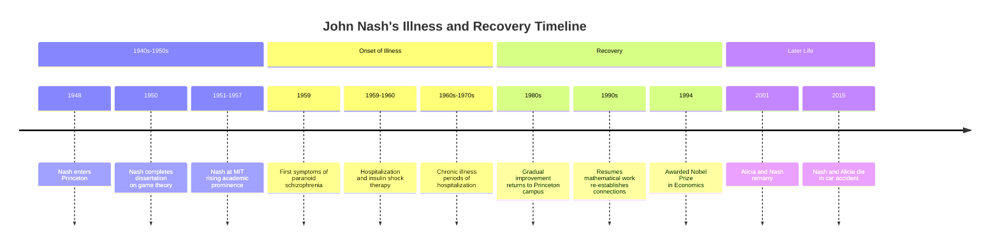

# A Beautiful Mind — Book Summary

**Title:** A Beautiful Mind  
**Author:** Sylvia Nasar

---

## 1. Executive Summary (Executive Audience)

This biography chronicles the life of John Forbes Nash Jr., a mathematical genius whose groundbreaking work in game theory revolutionized economics, and whose decades-long battle with paranoid schizophrenia became one of the most remarkable stories of recovery in medical history. The book traces Nash's journey from a brilliant but socially awkward student at Princeton and MIT, through his rise to academic prominence, his descent into mental illness, and his eventual recovery and recognition with the Nobel Prize in Economics.

The central thesis is that genius and mental illness can coexist, and that the human mind possesses remarkable resilience even after decades of profound psychological breakdown. Strategically, the book matters because it offers insights into the nature of creativity, the limits of psychiatric understanding, and the importance of institutional and personal support systems in recovery. It also illuminates the economic and scientific impact of game theory, which has influenced fields from Cold War strategy to evolutionary biology.

---

## 2. Key Concepts (Deep Study Notes)

### Game Theory

Game theory is the mathematical study of strategic decision-making among rational actors. Nash's most famous contribution, the Nash Equilibrium, describes a situation where no player can benefit by changing their strategy while other players keep theirs unchanged. This concept transformed economics by providing a framework for analyzing competitive situations where outcomes depend on the choices of multiple participants.

**Example:** In the Prisoner's Dilemma, two suspects are interrogated separately. The Nash Equilibrium occurs when both confess, even though both would be better off if both remained silent. This concept supports the book's central argument by demonstrating Nash's intellectual brilliance and the lasting impact of his work despite his illness.

### Schizophrenia

Schizophrenia is a severe mental disorder characterized by delusions, hallucinations, and disorganized thinking. The book documents Nash's specific manifestation—paranoid schizophrenia—which began in his late twenties and lasted for approximately three decades. The author provides a detailed account of how the illness manifested in Nash's life, including his belief in conspiracies, his delusions of grandeur, and his withdrawal from reality.

**Example:** Nash believed he was receiving messages through the New York Times and that he was being recruited by extraterrestrials. This concept is central to the book's narrative, as it represents the primary obstacle Nash overcame and the context for his eventual recovery.

### The Nash Equilibrium

The Nash Equilibrium is a solution concept in non-cooperative games where each player's strategy is optimal given the strategies of all other players. Nash proved that every finite game has at least one equilibrium point, a theorem that earned him the Nobel Prize in 1994. This mathematical breakthrough provided a foundation for analyzing economic competition, international relations, and evolutionary biology.

**Example:** In oligopoly markets, firms reach an equilibrium where no firm can increase profits by changing prices or output unilaterally. This concept supports the book's argument by establishing Nash's lasting intellectual legacy independent of his illness.

### Recovery from Schizophrenia

The book challenges the prevailing medical consensus of the 1980s that schizophrenia is a progressive, irreversible disease. Nash's recovery in his sixties—without medication—suggests that recovery is possible even after decades of illness. The author attributes this recovery to a combination of factors: the natural aging process, Nash's own determination to regain rationality, and the supportive environment at Princeton.

**Example:** Nash gradually returned to mathematical work in the 1980s, re-establishing connections with colleagues and eventually resuming research. This concept supports the book's theme of resilience and challenges deterministic views of mental illness.

### The Princeton Mathematics Community

The book portrays the Princeton mathematics department of the 1940s and 1950s as a unique intellectual environment that both nurtured and challenged Nash. This community included figures like Albert Einstein, John von Neumann, and other leading mathematicians who created an atmosphere of intense intellectual competition and collaboration.

**Example:** Nash's interactions with these figures, particularly his rivalry with other young mathematicians, shaped his development and his approach to problem-solving. This concept illustrates the importance of intellectual communities in fostering genius.

---

## 3. Deep Study Notes

### The Relationship Between Genius and Mental Illness

The book explores the complex relationship between Nash's mathematical genius and his schizophrenia. Nasar does not suggest a causal link but rather presents both as aspects of Nash's unique mind. The author documents how Nash's illness manifested during his most productive years, and how his recovery coincided with a return to mathematical work.

**Assumption:** The author assumes that Nash's recovery was genuine and that his later work was of comparable quality to his earlier contributions, despite the decades of illness.

**Implication:** This challenges the notion that schizophrenia inevitably destroys cognitive capacity and suggests that recovery, while rare, is possible even after prolonged illness.

### The Role of Institutions in Recovery

Nasar documents how Princeton University and the Institute for Advanced Study provided a supportive environment for Nash during his illness and recovery. Unlike many institutions that might have abandoned a mentally ill former faculty member, Princeton allowed Nash to remain on campus, where he became known as the "Phantom of Fine Hall."

**Assumption:** The author assumes that this institutional support was crucial to Nash's recovery, providing stability and a connection to his intellectual identity.

**Implication:** This suggests that how institutions treat mentally ill individuals can significantly affect their outcomes, and that maintaining connection to one's professional identity may aid recovery.

### The Evolution of Psychiatric Understanding

The book traces the changing understanding of schizophrenia from the 1950s to the 1990s. During Nash's initial illness, treatments included insulin shock therapy and antipsychotic medications with severe side effects. By the time of his recovery, the understanding of schizophrenia had evolved to recognize the possibility of recovery and the importance of psychosocial factors.

**Assumption:** The author assumes that the earlier medical treatments were both ineffective and harmful, and that the evolving understanding of schizophrenia contributed to better outcomes.

**Implication:** This highlights the importance of continued research and the dangers of dogmatic medical approaches.

### Nash's Personal Relationships

The book examines Nash's relationships with his wife Alicia, his colleagues, and his family. Alicia's decision to divorce Nash but continue supporting him, and their eventual remarriage, is presented as a crucial factor in his recovery. The author also documents Nash's difficult relationships with other mathematicians, characterized by competitiveness and occasional hostility.

**Assumption:** The author assumes that personal relationships significantly influenced both the course of Nash's illness and his recovery.

**Implication:** This suggests that social support is a critical factor in mental health outcomes, and that personal relationships can either exacerbate or mitigate mental illness.

### The Impact of Game Theory

Nasar provides context for how Nash's work in game theory influenced multiple fields beyond economics, including political science, biology, and computer science. The book explains how the Nash Equilibrium became a foundational concept in these fields and continues to be applied in new contexts.

**Assumption:** The author assumes that Nash's work was genuinely revolutionary and that its impact justifies the Nobel Prize recognition despite his decades of inactivity.

**Implication:** This demonstrates how theoretical work can have practical applications across disciplines, sometimes decades after its creation.

### The Timeline of Nash's Illness and Recovery

### The Interplay of Mathematics and Reality

The book explores how Nash's mathematical worldview influenced his perception of reality. His belief in mathematical patterns and his tendency to see hidden structures in the world may have contributed both to his mathematical insights and to his paranoid delusions.

**Assumption:** The author assumes that Nash's mathematical thinking style was related to both his genius and his illness.

**Implication:** This suggests that the cognitive traits that enable exceptional achievement may also predispose individuals to certain forms of mental illness.

---

## 4. Key Takeaways

- **Genius and mental illness can coexist** — Nash's story demonstrates that exceptional intellectual ability does not protect against mental illness, nor does mental illness necessarily destroy intellectual capacity permanently.

- **Recovery from schizophrenia is possible** — Nash's recovery after three decades of illness challenges the view that schizophrenia is inevitably progressive and irreversible.

- **Institutional support matters** — Princeton's decision to allow Nash to remain on campus during his illness provided stability and connection to his intellectual identity, which likely contributed to his recovery.

- **Personal relationships are critical** — Alicia's continued support of Nash, even after their divorce, was a crucial factor in his eventual recovery.

- **Game theory has broad applications** — Nash's work influenced fields far beyond economics, demonstrating how theoretical mathematics can have wide-ranging practical impact.

- **The importance of intellectual community** — The Princeton mathematics environment provided both the stimulation that drove Nash's early work and the support that enabled his later recovery.

- **Medical understanding evolves** — The changing treatment of schizophrenia from the 1950s to the 1990s reflects broader shifts in psychiatric understanding and the dangers of dogmatic approaches.

- **Identity and recovery are connected** — Nash's return to mathematical work was both a sign of his recovery and a factor that facilitated it, suggesting that maintaining connection to one's professional identity can aid mental health.

- **Recognition can come late** — Nash received the Nobel Prize thirty years after his major contributions, demonstrating that the value of work may not be immediately recognized.

- **Resilience is possible** — Nash's story is ultimately one of resilience—the ability to recover from profound breakdown and regain meaningful function after decades of disability.

---

## 5. Organization of the Book

The book is organized chronologically, following Nash's life from his childhood in West Virginia through his education, his rise to prominence, his illness, and his recovery. The narrative is divided into several major sections:

**Early Life and Education** — The first section covers Nash's childhood, his undergraduate education at Carnegie Tech, and his graduate work at Princeton. This section establishes Nash's character—brilliant but socially awkward—and introduces the intellectual environment that shaped his early work.

**Rise to Prominence** — The second section details Nash's time at MIT, his contributions to game theory and other areas of mathematics, and his growing reputation in the academic community. This section establishes the significance of his work before his illness.

**Onset of Illness** — The third section describes the emergence of Nash's schizophrenia, his initial hospitalizations, and the impact of his illness on his career and personal life. This section marks the turning point in the narrative.

**Decades of Illness** — The fourth section covers the long period of Nash's illness, including his various hospitalizations, his wandering through Europe, and his gradual withdrawal from the mathematical community. This section is the darkest part of the narrative.

**Recovery and Recognition** — The final section describes Nash's gradual return to rationality, his reconnection with the mathematical community, and his receipt of the Nobel Prize. This section provides the resolution to the narrative arc.

The book's structure supports its central argument by showing the complete arc of Nash's life, allowing readers to see both the devastation caused by his illness and the possibility of recovery. The chronological organization emphasizes the long duration of Nash's illness and the gradual nature of his recovery.

---

## 6. Chapter-Wise Breakdown

1. **West Virginia** — Nash's childhood and early education, establishing his intellectual precocity and social difficulties.

2. **Carnegie** — Nash's undergraduate years, his switch from chemistry to mathematics, and his early recognition of mathematical talent.

3. **Princeton** — Nash's arrival at Princeton, his interactions with the mathematics community, and the beginning of his work on game theory.

4. **The Theory of Games** — Nash's development of the Nash Equilibrium and his dissertation work, establishing his contribution to game theory.

5. **The RAND Corporation** — Nash's work at RAND during the summers, applying game theory to Cold War strategy problems.

6. **MIT** — Nash's appointment at MIT, his continued mathematical work, and his growing reputation in the field.

7. **Alicia** — Nash's relationship with Alicia Larde, their marriage, and the early signs of his illness.

8. **The Crack-Up** — The onset of Nash's paranoid schizophrenia, his first hospitalization, and the beginning of his decline.

9. **The Hospital** — Nash's experience with insulin shock therapy and other treatments, and the failure of early interventions.

10. **The Phantom** — Nash's years wandering through Europe and the United States, his delusions, and his withdrawal from the mathematical community.

11. **The Return** — Nash's gradual return to Princeton, his reconnection with colleagues, and the beginning of his recovery.

12. **The Nobel** — Nash's receipt of the Nobel Prize, the recognition of his work, and the validation of his recovery.

13. **Reunion** — Nash's remarriage to Alicia and his reintegration into the mathematical community.

14. **Aftermath** — The later years of Nash's life, his continued mathematical work, and his death in 2015.
