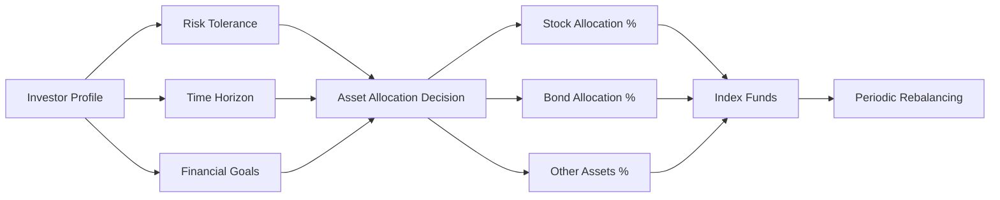

# A Random Walk Down Wall Street - Summary

**Author**: Burton G. Malkiel

---

## 1. Executive Summary (Executive Audience)

"A Random Walk Down Wall Street" is a seminal work on investment strategy that challenges conventional wisdom about stock market investing. The book presents the case for the efficient market hypothesis, arguing that stock prices move randomly and that neither professional investors nor individual investors can consistently outperform the market through stock selection or market timing. Malkiel demonstrates that technical analysis, fundamental analysis, and even most professional money management fail to deliver superior risk-adjusted returns over the long term.

The central thesis is that the stock market is highly efficient, meaning that current prices already reflect all available information. Consequently, the optimal investment strategy for most investors is to buy and hold broadly diversified index funds, particularly those tracking the entire stock market. This passive approach minimizes costs, reduces risk, and historically outperforms the majority of actively managed funds. The book matters strategically because it provides a data-driven foundation for long-term investment policy, helping organizations and individuals avoid costly active management fees and the pitfalls of market speculation.

- **First published**: 1973
- **Latest edition**: 12th edition (2020)
- **Republishing history**: Updated approximately every 3-4 years to incorporate new research, market developments, and investment products

---

## 2. Key Concepts (Deep Study Notes)

### Efficient Market Hypothesis (EMH)

The Efficient Market Hypothesis is the foundational concept of the book. It asserts that financial markets are informationally efficient, meaning that current security prices fully reflect all available information. Malkiel distinguishes between three forms of efficiency:

- **Weak Form**: Current prices reflect all historical price and volume data. Technical analysis, which attempts to predict future prices based on past patterns, cannot consistently generate excess returns.
- **Semi-Strong Form**: Current prices reflect all publicly available information, including financial statements, news, and economic data. Fundamental analysis cannot consistently identify undervalued stocks.
- **Strong Form**: Current prices reflect all information, both public and private (insider information). Even insiders cannot consistently profit from non-public information.

The EMH supports the book's central argument because if markets are efficient, then attempts to beat the market through stock selection or timing are futile. The only way to achieve superior returns is through taking on additional risk, not through skill.

**Example**: Malkiel presents numerous studies showing that mutual funds with superior past performance rarely continue to outperform. The "hot hands" phenomenon in fund management is largely a statistical artifact, not evidence of skill.

### Random Walk Theory

The random walk theory posits that stock price changes are independent and identically distributed, meaning that past price movements cannot predict future movements. The term "random walk" comes from the statistical concept where each step is independent of the previous one. In financial markets, this implies that price changes follow a patternless path.

Malkiel uses this concept to debunk both technical analysis (which relies on patterns in past prices) and the idea that investors can time market entries and exits. If prices follow a random walk, then tomorrow's price change is independent of today's price change, making prediction impossible.

**Example**: The book presents coin-flipping experiments to illustrate how random processes can create apparent patterns. If enough people flip coins, some will achieve long streaks of heads—similar to how some investors appear to have "hot hands" through pure chance.

### Technical Analysis and Its Failures

Technical analysis attempts to predict future price movements by analyzing historical price and volume data, often through chart patterns and indicators. Malkiel systematically dismantles this approach, presenting empirical evidence that technical rules do not generate consistent risk-adjusted profits.

Common technical methods examined include:
- Filter rules (buy when prices rise by X%, sell when they fall by Y%)
- Moving average strategies
- Relative strength indicators
- Chart patterns (head and shoulders, triangles, etc.)

Malkiel demonstrates that while some technical rules may appear profitable in historical testing, they fail to produce consistent results out-of-sample and fail to generate excess returns after accounting for transaction costs and risk.

This concept supports the book's thesis by showing that even sophisticated analysis of price patterns cannot overcome market efficiency.

### Fundamental Analysis and Its Limitations

Fundamental analysis attempts to determine the intrinsic value of a stock by analyzing financial statements, industry conditions, management quality, and economic factors. While more rigorous than technical analysis, Malkiel argues that fundamental analysis also fails to consistently beat the market.

The book explains that:
- Professional analysts have access to the same information
- Competition among analysts ensures that information is quickly incorporated into prices
- Even when analysts identify mispricings, the market often corrects them before individual investors can profit
- The cost of active management (fees, taxes, transaction costs) erodes any potential alpha

**Example**: Malkiel cites studies showing that stocks recommended by analysts as "buys" do not outperform the market, and that earnings surprise information is quickly incorporated into prices, leaving little opportunity for investors to profit.

### Index Fund Investing

Index fund investing is the practical solution Malkiel proposes. Index funds are passively managed portfolios that track a market benchmark, such as the S&P 500 or a total market index. They offer:

- Low costs (expense ratios typically below 0.1%)
- Broad diversification
- Tax efficiency
- Transparency
- Consistent performance relative to the benchmark

The book advocates for a simple investment strategy: allocate assets based on risk tolerance and age, invest in low-cost index funds, and hold for the long term. This approach has historically outperformed the majority of actively managed funds.

**Example**: Malkiel presents data showing that over 10-year periods, approximately 70-80% of actively managed funds underperform their benchmarks. The percentage is even higher over longer time horizons.

### Behavioral Finance

While the book emphasizes market efficiency, Malkiel acknowledges that behavioral biases can create temporary market inefficiencies. However, he argues that these inefficiencies are:
- Difficult to identify in real-time
- Often too small to profit from after costs
- Unpredictable in direction and duration
- Arbitraged away by sophisticated investors

Behavioral biases discussed include:
- Overconfidence
- Herd behavior
- Loss aversion
- Mental accounting
- Anchoring

This concept supports the thesis by acknowledging that while markets aren't perfectly efficient, the inefficiencies are not reliably exploitable by individual investors.

---

## 3. Deep Study Notes

### The Historical Evolution of Investment Theory

The book traces the development of investment thinking from the early days of technical analysis through modern portfolio theory and behavioral finance. This historical context helps readers understand how investment strategies have evolved and why certain approaches persist despite evidence of their ineffectiveness.

Early stock market participants relied heavily on technical analysis, believing that patterns in price movements could predict future prices. The development of fundamental analysis in the 1930s, exemplified by Benjamin Graham's "Security Analysis," provided a more rigorous framework for valuing securities. However, Malkiel argues that the widespread adoption of these methods has made them less effective as markets became more efficient.

The academic challenge to active management began in the 1960s with the development of the efficient market hypothesis and modern portfolio theory. These theories provided mathematical foundations for understanding risk, return, and market efficiency. The book presents this evolution to show how academic research has increasingly supported passive investment strategies.

**Assumption**: The author assumes that academic research provides reliable insights into market behavior, despite the fact that academics themselves disagree on the degree of market efficiency.

**Implication**: If markets have become more efficient over time due to information technology and competition, then strategies that worked in the past may not work in the future. This strengthens the case for passive investing.

### Risk and Return Relationship

Malkiel explains the fundamental relationship between risk and return: higher expected returns come with higher risk. However, the key insight is that investors must distinguish between systematic risk (market risk that cannot be diversified away) and unsystematic risk (company-specific risk that can be diversified away).

The book presents the Capital Asset Pricing Model (CAPM) as a framework for understanding this relationship. According to CAPM:
- Expected return = Risk-free rate + Beta × (Market return - Risk-free rate)
- Beta measures a stock's sensitivity to market movements
- Investors are only compensated for taking systematic risk, not unsystematic risk

This has important implications:
- Diversification eliminates uncompensated risk
- Investors should hold diversified portfolios rather than concentrating in individual stocks
- The optimal portfolio for most investors is the market portfolio (or a proxy like a total market index fund)

```mermaid
graph TD
    A[Total Risk] --> B[Systematic Risk<br/>(Market Risk)]
    A --> C[Unsystematic Risk<br/>(Company-Specific Risk)]
    B --> D[Cannot be diversified away<br/>Compensated with higher expected return]
    C --> E[Can be diversified away<br/>Not compensated]
    F[Diversification] --> G[Reduces unsystematic risk]
    G --> H[Investor left with systematic risk only]
    H --> I[Optimal portfolio = Market portfolio]
```

**Assumption**: The CAPM accurately describes the relationship between risk and return, despite empirical challenges to the model.

**Implication**: Since diversification is free (eliminates risk without reducing expected return), all investors should hold diversified portfolios. This supports the index fund approach.

### The Failure of Professional Money Management

A significant portion of the book is dedicated to demonstrating that professional money managers, on average, fail to beat the market after fees. Malkiel presents extensive evidence from mutual fund performance studies, showing that:

- Most actively managed funds underperform their benchmarks over long periods
- Past performance is not a reliable predictor of future performance
- Fund expenses are a strong predictor of relative performance (lower expenses correlate with better performance)
- The few funds that do outperform in one period rarely repeat in subsequent periods

The book explains why this is the case:
- High expense ratios erode returns
- High portfolio turnover generates transaction costs and tax liabilities
- Competition among managers makes it difficult to consistently identify mispriced securities
- The sheer number of managers ensures some will outperform by chance, but identifying them in advance is impossible

**Example**: Malkiel presents the "dartboard" experiment, where stocks chosen randomly (by throwing darts at a stock table) performed similarly to stocks recommended by experts.

**Assumption**: The studies cited are representative and not subject to survivorship bias or other methodological flaws.

**Implication**: If professionals cannot consistently beat the market, individual investors certainly cannot. The rational choice is to invest in index funds.

### Asset Allocation and Portfolio Construction

While advocating for passive investing, Malkiel provides detailed guidance on asset allocation—the process of dividing investments among different asset classes (stocks, bonds, cash, real estate, etc.) based on risk tolerance, time horizon, and financial goals.

The book presents a framework for determining appropriate asset allocation:
- Younger investors with longer time horizons should allocate more to stocks
- As investors age and approach retirement, they should gradually shift toward bonds and cash
- Risk tolerance should be assessed objectively, not subjectively
- Rebalancing should occur periodically to maintain target allocations

Malkiel emphasizes that asset allocation is far more important than stock selection in determining portfolio returns. He cites studies showing that asset allocation explains more than 90% of the variation in portfolio returns, while stock selection and market timing explain very little.



**Assumption**: Historical risk-return relationships will persist in the future.

**Implication**: Investors should focus their energy on getting asset allocation right rather than trying to pick winning stocks or time the market.

### The Role of New Investment Products

The book discusses newer investment products that have emerged since earlier editions, including:

- **ETFs (Exchange-Traded Funds)**: Similar to index funds but trade like stocks, offering intraday liquidity and often lower expenses
- **Target-date funds**: Automatically adjust asset allocation based on the investor's expected retirement date
- **Robo-advisors**: Automated investment services that provide portfolio management based on algorithms
- **Smart beta funds**: Attempt to capture specific factors (value, momentum, quality, size) while maintaining passive management

Malkiel generally supports these innovations when they lower costs and simplify investing for individuals. However, he remains skeptical of products that claim to provide market-beating returns through factor investing, arguing that these factors may not persist once widely known and arbitraged away.

**Assumption**: New investment products that reduce costs and complexity benefit investors, while products claiming alpha are likely to disappoint.

**Implication**: Investors should embrace low-cost, simple investment products and avoid complex, expensive products that promise superior returns.

### The Impact of Taxes and Inflation

The book emphasizes the importance of considering taxes and inflation in investment planning. These factors can significantly erode real returns:

- **Taxes**: Capital gains taxes, dividend taxes, and interest income taxes reduce after-tax returns. Tax-efficient investing strategies include:
  - Holding investments in tax-advantaged accounts (IRAs, 401(k)s)
  - Using tax-efficient index funds
  - Minimizing turnover to defer capital gains
  - Harvesting tax losses to offset gains

- **Inflation**: Inflation reduces the purchasing power of investment returns. Real returns (nominal returns minus inflation) are what matter for investors' ability to maintain their lifestyle.

Malkiel presents calculations showing how taxes and inflation can dramatically reduce effective returns, making it even more important to minimize costs through passive investing.

**Assumption**: Tax rates and inflation rates will remain within historically normal ranges.

**Implication**: Tax-efficient investing is crucial, and index funds are generally more tax-efficient than actively managed funds due to lower turnover.

### International Diversification

The book advocates for international diversification as a way to reduce portfolio risk without necessarily reducing expected returns. By investing globally, investors can:
- Benefit from economic growth in different regions
- Reduce concentration in any single country's economic or political risks
- Potentially capture higher returns in emerging markets
- Hedge against currency fluctuations (though currency risk cuts both ways)

Malkiel recommends that international stocks should constitute 20-30% of the equity portion of a portfolio for most investors, though this can vary based on individual circumstances.

**Assumption**: International markets will not become perfectly correlated with the U.S. market, preserving the diversification benefit.

**Implication**: Global index funds should be part of a well-diversified portfolio.

---

## 4. Key Takeaways

- Stock prices follow a random walk; past price movements cannot predict future movements
- Markets are highly efficient; current prices reflect all available information
- Technical analysis (chart patterns, indicators) does not consistently generate profits
- Fundamental analysis fails to deliver consistent risk-adjusted outperformance
- Most actively managed mutual funds underperform their benchmarks over long periods
- Past fund performance is not a reliable indicator of future performance
- Low-cost index funds historically outperform the majority of actively managed funds
- Asset allocation is the primary determinant of portfolio returns, not stock selection
- Diversification eliminates uncompensated risk without reducing expected return
- Younger investors should hold more stocks; older investors should hold more bonds
- Rebalance portfolios periodically to maintain target asset allocations
- Minimize investment costs (expense ratios, transaction costs, taxes)
- Use tax-advantaged accounts when possible
- Consider international diversification to reduce portfolio risk
- Ignore market forecasts and hot tips; they are no better than random guesses
- Focus on long-term investing rather than short-term trading
- Avoid market timing; it is impossible to consistently predict market movements
- Invest consistently through dollar-cost averaging rather than trying to time entries
- Stay the course during market volatility; emotional selling destroys wealth
- The optimal strategy for most investors is simple: buy and hold diversified index funds

---

## 5. Organization of the Book

The book is organized into four main parts that build logically from historical context to practical investment advice.

**Part I: Stocks and Their Value**
This section provides historical background on stock market investing, tracing the evolution from early speculation to modern markets. It introduces key concepts such as the firm-foundation theory and the castle-in-the-air theory of stock valuation. This historical foundation helps readers understand why certain investment beliefs persist and how markets have evolved over time. The section sets the stage for the efficient market hypothesis by showing how technological advances and increased competition have made markets more efficient.

**Part II: How the Pros Play the Investment Game**
This part examines the performance and methods of professional investors, including technical analysts, fundamental analysts, and academic theorists. Malkiel systematically critiques each approach, presenting empirical evidence of their failures to consistently beat the market. This section is crucial because it addresses the common investor belief that professionals have superior skills or information. By demonstrating that even the best professionals fail to outperform, the book strengthens the case for passive investing.

**Part III: The New Investment Technology**
This section covers modern portfolio theory, the efficient market hypothesis, and behavioral finance. It provides the theoretical foundation for the book's recommendations, explaining why markets are efficient and why attempts to beat them are likely to fail. The section also discusses new investment products such as index funds, ETFs, and robo-advisors, showing how technology has made passive investing accessible to individual investors. This theoretical framework is essential for understanding the practical advice that follows.

**Part IV: A Life-Cycle Guide to Investing**
The final part provides practical, actionable investment advice based on the principles established earlier. It covers asset allocation, portfolio construction, and specific investment strategies for different life stages. Malkiel addresses common investor mistakes and provides guidance on retirement planning, tax-efficient investing, and managing portfolio risk. This section translates theory into practice, giving readers a complete roadmap for implementing a passive investment strategy.

The book's structure moves from history to theory to practice, allowing readers to first understand why active investing fails before learning how to implement passive investing successfully. This logical progression builds a compelling case that is both intellectually rigorous and practically useful.

---

## 6. Chapter-Wise Breakdown

### Part I: Stocks and Their Value

1. **Firm Foundations and Castles in the Air**
   - Contrasts two theories of stock valuation: firm-foundation (intrinsic value based on fundamentals) and castle-in-the-air (psychological factors drive prices)
   - Historical examples of market bubbles from tulip mania to the dot-com bubble
   - Demonstrates how psychological factors can drive prices away from fundamental value
   - Introduces the concept that both theories may explain market behavior at different times

2. **The Madness of Crowds**
   - Examines historical speculative bubbles and manias
   - Discusses the role of crowd psychology in market excesses
   - Presents examples from the South Sea Bubble, the 1929 crash, and the 2008 financial crisis
   - Shows how collective behavior can create and sustain irrational market prices

3. **Speculative Bubbles and the Market**
   - Analyzes the characteristics of speculative bubbles
   - Discusses the difficulty of identifying bubbles in real-time
   - Presents evidence that bubbles are more common than generally believed
   - Explains why even sophisticated investors can be caught up in bubbles

4. **Technical Analysis and the Random Walk**
   - Systematically critiques technical analysis methods
   - Presents empirical studies showing technical rules fail to generate consistent profits
   - Explains why chart patterns appear meaningful but are statistically meaningless
   - Introduces the random walk theory and its implications for technical analysis

### Part II: How the Pros Play the Investment Game

5. **Technical and Fundamental Analysis**
   - Compares technical and fundamental analysis approaches
   - Presents evidence that neither approach consistently beats the market
   - Discusses the challenges of implementing fundamental analysis effectively
   - Explains why professional analysts fail to deliver alpha

6. **Technical Systems**
   - Examines specific technical trading systems and rules
   - Presents backtesting results showing apparent profitability that disappears out-of-sample
   - Discusses data mining and survivorship bias in technical analysis research
   - Explains why technical systems that worked historically may not work in the future

7. **Fundamental Analysis**
   - Details the fundamental analysis process and its limitations
   - Presents studies showing analysts' recommendations do not outperform the market
   - Discusses the challenges of forecasting earnings and growth rates
   - Explains why even good fundamental analysis may not translate into market-beating returns

8. **New Investment Technologies**
   - Covers modern investment tools and technologies
   - Discusses the impact of computers and algorithms on market efficiency
   - Examines whether new technologies create or eliminate investment opportunities
   - Presents evidence that technology has made markets more efficient, not less

9. **A New Walking Shoe: The Index Fund**
   - Introduces index funds as the solution to active management's failures
   - Presents historical performance data comparing index funds to active funds
   - Explains the mechanics of index fund construction and operation
   - Discusses the advantages of index funds in terms of cost, diversification, and tax efficiency

### Part III: The New Investment Technology

10. **The Efficient Market Hypothesis**
    - Presents the efficient market hypothesis in detail
    - Distinguishes between weak, semi-strong, and strong forms of efficiency
    - Presents empirical evidence supporting each form
    - Addresses common criticisms and counterarguments to EMH

11. **The Random Walk Theory**
    - Provides mathematical foundation for the random walk theory
    - Presents statistical tests of the random walk hypothesis
    - Explains how random walks can create apparent patterns
    - Discusses the implications of random walks for investment strategy

12. **Behavioral Finance**
    - Introduces behavioral finance as a challenge to EMH
    - Discusses common behavioral biases that affect investor decisions
    - Presents evidence that behavioral biases can create market inefficiencies
    - Explains why these inefficiencies may not be reliably exploitable

13. **Potshots at the Efficient Market Theory**
    - Addresses criticisms of the efficient market hypothesis
    - Discusses apparent market anomalies that seem to contradict EMH
    - Examines whether anomalies persist after accounting for risk and costs
    - Concludes that while markets aren't perfectly efficient, they are efficient enough to defeat active management

### Part IV: A Life-Cycle Guide to Investing

14. **A Life-Cycle Guide to Investing**
    - Provides framework for determining appropriate asset allocation
    - Discusses how risk tolerance, time horizon, and goals should affect allocation
    - Presents sample portfolios for different life stages
    - Emphasizes the importance of starting early and staying invested

15. **Three Giant Steps to Stock Market Wealth**
    - Outlines three key steps: start early, invest regularly, and stay the course
    - Demonstrates the power of compound growth over time
    - Discusses dollar-cost averaging as a risk-reduction strategy
    - Emphasizes the importance of avoiding emotional investment decisions

16. **A Portfolio for the Long Run**
    - Provides specific portfolio recommendations for long-term investors
    - Discusses the appropriate mix of domestic and international stocks
    - Addresses the role of bonds and other asset classes
    - Recommends specific low-cost index funds and ETFs

17. **The Internet and the Investor**
    - Discusses how the internet has changed investing
    - Addresses the proliferation of investment information and misinformation online
    - Warns against internet-based scams and get-rich-quick schemes
    - Recommends reliable online resources for investors

18. **Potshots at the Efficient Market Theory**
    - Revisits criticisms of efficient market hypothesis
    - Addresses newer challenges and counterarguments
    - Discusses whether the rise of passive investing itself might create inefficiencies
    - Concludes that passive investing remains the optimal strategy despite theoretical concerns
