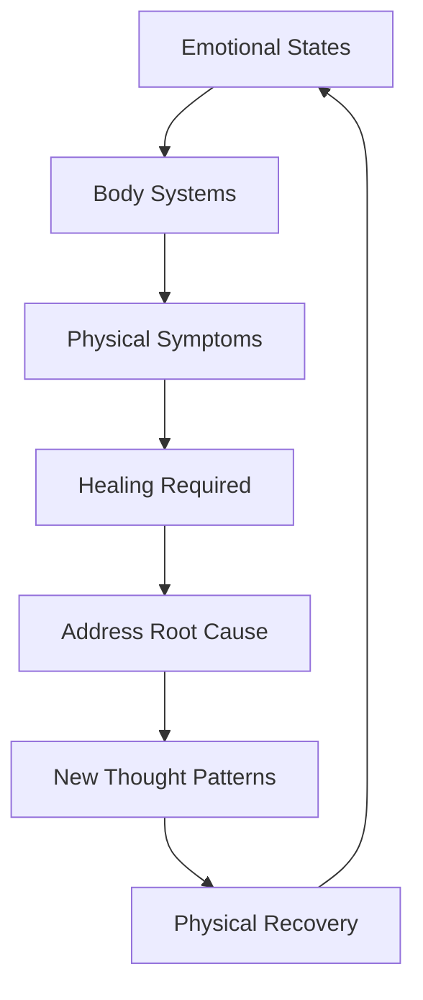
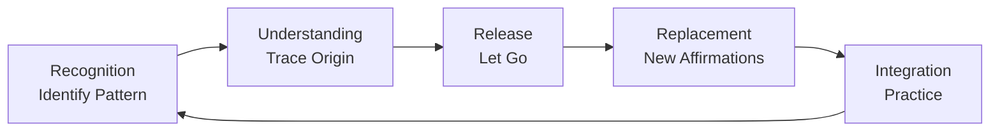

# 📘 *Heal Your Body* — Louise L. Hay

***

## 1. Executive Summary (Executive Audience)

*Heal Your Body* is a concise, reference‑style book that presents **Louise Hay’s core premise: physical illnesses are linked to specific mental and emotional patterns**, and healing can begin by consciously changing those patterns. Rather than offering extended narrative or case studies, the book functions as a **diagnostic map**, pairing physical symptoms with probable emotional causes and corresponding affirmations.

For senior leaders and executives, the strategic value lies in its **systems‑thinking approach to well‑being**. The book encourages readers to view the mind, emotions, and body as an interconnected system rather than isolated components. This perspective supports long‑term resilience, stress management, and sustainable performance by emphasizing self‑awareness, emotional responsibility, and mental reframing as foundational drivers of health and effectiveness.

***

## 2. Key Concepts (Deep Study Notes)

### 🌱 1. Psychosomatic Root of Illness

**Concept:** Physical conditions reflect underlying emotional and mental patterns.\
**Explanation:** Hay associates specific illnesses with recurring emotional states such as fear, resentment, guilt, or self‑criticism. The body is viewed as expressing unresolved inner conflicts.\
**Examples:**

*   Back problems linked to lack of emotional support
*   Throat issues associated with suppressed self‑expression\
    **Support to Central Argument:** Establishes the book’s core idea that healing requires addressing inner causes, not only physical symptoms.

***

### 🧠 2. Responsibility Without Blame

**Concept:** Individuals are responsible for their health, but not at fault.\
**Explanation:** Hay distinguishes responsibility from blame: recognizing one’s role in creating patterns empowers change without inducing guilt.\
**Examples:**

*   Viewing illness as feedback rather than punishment\
    **Support to Central Argument:** Encourages agency and compassion, making self‑healing psychologically possible.

***

### 💖 3. Affirmative Re‑Patterning

**Concept:** Affirmations help replace harmful mental patterns.\
**Explanation:** Each illness is paired with a **positive affirmation** designed to neutralize the underlying emotional cause and introduce a healthier belief.\
**Examples:**

*   Physical issue: headaches
*   Affirmation: “I relax and allow my mind to be peaceful.”\
    **Support to Central Argument:** Provides a practical mechanism for internal change.

***

### 🪞 4. Self‑Love as the Universal Healer

**Concept:** Lack of self‑love underlies most mental and physical distress.\
**Explanation:** Hay asserts that self‑criticism and self‑rejection manifest as bodily tension and illness, while self‑acceptance restores balance.\
**Examples:**

*   “I approve of myself” as a universal affirmation\
    **Support to Central Argument:** Acts as the unifying theme across all conditions listed.

***

### 🔄 5. Mind–Emotion–Body Unity

**Concept:** The body mirrors the mind and emotional state.\
**Explanation:** No illness is isolated; physical symptoms, emotional context, and mental habits form a feedback loop.\
**Support to Central Argument:** Reinforces the holistic structure underlying the book’s mapping system.

***

## 3. Deep Study Notes

### The Core Mapping Framework

At the heart of *Heal Your Body* is a **three‑part mapping system**:

1.  Physical condition
2.  Probable emotional cause
3.  Healing affirmation

This framework encourages awareness first, then conscious re‑patterning.

***

### Key Assumptions

*   Emotional states precede physical manifestation.
*   The subconscious mind responds to repeated thought patterns.
*   The body cooperates in healing when mental resistance is released.

***

### Connection of Ideas

*   **Emotional awareness** reveals patterns
*   **Responsibility** enables choice
*   **Affirmations** initiate internal change
*   **Self‑love** sustains healing

Together, these ideas form a **self‑correcting system** rather than a one‑time cure.

***

### Implications

*   Healing becomes an ongoing practice rather than an external intervention.
*   Illness is reframed as communication, not failure.
*   The individual becomes an active participant in well‑being.

***

## 4. Key Takeaways

*   Physical symptoms often mirror emotional conflicts.
*   Awareness precedes healing.
*   Responsibility empowers; blame paralyzes.
*   Affirmations work through repetition and emotional alignment.
*   Self‑love is foundational, not optional.
*   Healing is a process, not a quick fix.

***

## 5. Organization of the Book

The book is structured as a **practical reference guide**, not a linear narrative. It begins with a brief philosophical introduction explaining the mind–body connection, followed by a **comprehensive alphabetical listing of physical conditions**. Each entry includes:

*   The condition
*   Likely emotional causes
*   A recommended affirmation

This structure allows readers to **enter the book at their point of need**, reinforcing its role as a daily or long‑term healing companion.

***

## 6. Chapter‑Wise Breakdown

### 1. Introduction: The Mind–Body Relationship

*   Overview of psychosomatic philosophy
*   The role of thought in physical health
*   Responsibility without guilt

***

### 2. How to Use This Book

*   Explanation of the illness–emotion–affirmation format
*   Guidance on applying affirmations consistently

***

### 3. The Healing Reference Section (Alphabetical)

*(Grouped content rather than traditional chapters)*

**Examples of grouped entries:**

*   A–C Conditions
    *   Emotional causes and affirmations
    *   Emphasis on awareness and self‑acceptance

*   D–F Conditions
    *   Patterns of fear, resentment, or pressure

*   G–L Conditions
    *   Links between stress, security, and self‑worth

*   M–R Conditions
    *   Themes of control, grief, and forgiveness

*   S–Z Conditions
    *   Self‑expression, joy, and life trust

***

### 4. Core Affirmations and Closing Notes

*   Reinforcement of self‑love
*   Healing as an ongoing inner dialogue
*   Encouragement toward patience and compassion

***

# Heal Your Body - Book Summary

## 1. Executive Summary (Executive Audience)

"Heal Your Body" by Louise Hay presents a comprehensive guide to the mental and emotional causes of physical illness and provides a systematic approach to healing through the power of thought and affirmations. The central thesis argues that physical symptoms are manifestations of underlying mental patterns, emotional states, and belief systems, and that addressing these root causes through positive mental work can facilitate physical healing and wellness. The book matters strategically for healthcare organizations and wellness programs because it offers a complementary approach to traditional medicine that empowers individuals to participate actively in their own healing process, potentially reducing healthcare costs through preventative mental health practices and promoting holistic well-being. Published as part of Louise Hay's body-mind philosophy, this work has been widely used as a reference for understanding the psychological dimensions of illness.

## 2. Key Concepts (Deep Study Notes)

### The Mind-Body Connection
This concept establishes that mental and emotional states directly influence physical health. Hay explains that every physical symptom has a corresponding mental pattern or emotional cause. For example, back pain often relates to feeling unsupported or burdened by responsibilities, while digestive issues may stem from difficulty assimilating new experiences or ideas. This concept supports the book's central argument by providing the foundational principle that healing must address both the physical symptom and its mental-emotional root. The author assumes that addressing the mental cause will facilitate physical recovery, which aligns with psychosomatic medicine principles.

### Probable Causes of Illness
Hay provides a comprehensive reference guide linking specific physical conditions to their probable mental causes. For instance, headaches may indicate self-criticism or fear, while skin conditions often relate to anxiety or feeling threatened. These associations are not presented as absolute scientific facts but as patterns observed through Hay's counseling work. This concept supports the book's practical application by giving readers a starting point for self-inquiry and reflection. The assumption is that understanding the probable mental cause enables individuals to choose new thought patterns that support healing.

### The Power of Affirmations
Affirmations are positive statements designed to replace negative mental patterns with constructive ones. Hay provides specific affirmations for each health condition, such as "I am safe and protected" for fear-related issues or "I lovingly forgive and release all the past" for conditions related to holding onto resentment. These affirmations work by reprogramming the subconscious mind with new, supportive beliefs. This concept is the primary practical tool in the book and supports the central thesis by providing the mechanism for mental change. The author assumes that consistent use of affirmations can override established negative patterns.

### Self-Love as Healing Foundation
Self-love and self-acceptance are presented as essential prerequisites for physical healing. Hay argues that illness often stems from self-rejection, criticism, or lack of self-worth. By cultivating genuine self-love, individuals create internal conditions that support wellness. For example, someone who constantly criticizes themselves may experience throat problems, as the throat represents expression and communication. Learning to speak kindly to oneself supports healing. This concept supports the book's argument by addressing the fundamental emotional state from which both mental patterns and physical symptoms emerge.

### Forgiveness and Release
Holding onto past hurts, anger, or resentment creates internal toxicity that manifests as physical illness. Hay emphasizes that forgiveness is not about condoning harmful actions but about releasing the emotional burden carried by the forgiver. For instance, cancer is often associated with deep hurt and longstanding resentment. The healing process involves consciously choosing to release these stored emotions and replacing them with peace and acceptance. This concept supports the central thesis by removing emotional blockages that prevent the flow of healing energy through the body.

## 3. Deep Study Notes

### The Relationship Between Emotions and Body Systems

The book categorizes health conditions by body systems and associates each with specific emotional patterns. This systematic approach helps readers understand that different parts of the body correspond to different psychological themes. The head relates to thinking and control, the throat to expression and creativity, the heart to love and emotional center, the stomach to assimilation and acceptance, and so on. This mapping provides a framework for understanding how emotional states distribute through the physical body.

The author assumes that these correlations are consistent across individuals, though she acknowledges that personal interpretation may vary. This assumption has implications for the book's methodology: it provides a structured starting point for self-inquiry while allowing for individual adaptation. The implication is that healing requires addressing the specific emotional pattern associated with the affected body system.

### The Process of Mental Reprogramming

Healing through mental work involves a systematic process of identifying, challenging, and replacing limiting beliefs. The first step is recognition—becoming aware of the negative thought pattern associated with the physical condition. The second step is understanding—seeing how this pattern developed and what purpose it may have served. The third step is release—consciously choosing to let go of the old pattern. The fourth step is replacement—establishing a new, positive pattern through affirmations and mental discipline.

Hay assumes that this process can be successfully completed through individual effort and consistent practice. This assumption places significant responsibility on the individual for their own healing, which can be empowering but may also overlook cases where professional therapeutic intervention is necessary. The implication is that healing is largely a matter of mental discipline rather than requiring external intervention.

### The Role of the Subconscious in Health

The book explains that the subconscious mind stores and acts upon our deepest beliefs, many of which were formed in childhood or through traumatic experiences. These subconscious beliefs operate automatically, influencing our physical health without conscious awareness. For example, someone who experienced abandonment in childhood may carry a subconscious belief that they are not safe, which could manifest as respiratory issues (the breath represents life and safety). Affirmations work by gradually influencing the subconscious through repetition and emotional engagement.

The author assumes that the subconscious is malleable and responsive to conscious direction through affirmations. Contemporary neuroscience research on neuroplasticity supports this assumption to some extent, though the book may oversimplify the complexity of deeply entrenched patterns. The implication is that consistent, patient practice can gradually shift subconscious programming and thereby influence physical health.

### The Limitations of the Mind-Body Approach

While the book presents the mind-body connection as a powerful healing tool, it does not claim that mental work alone can cure all conditions. Hay acknowledges that medical treatment may be necessary and that her approach is complementary rather than alternative. She encourages readers to work with healthcare professionals while also addressing the mental-emotional dimensions of their condition. This balanced perspective prevents the book from promoting dangerous ideas about abandoning conventional medical treatment.

The author assumes that the mental and physical approaches to healing are synergistic rather than mutually exclusive. This assumption has important implications: it allows the book to be used as a supportive tool alongside conventional medicine without promoting rejection of necessary medical care. The implication is that optimal healing addresses the whole person—mind, body, and spirit.

## 4. Key Takeaways

- Physical symptoms have mental and emotional causes that can be identified and addressed
- Specific body parts correspond to specific psychological themes and emotional patterns
- Affirmations are practical tools for reprogramming negative mental patterns
- Self-love and self-acceptance are foundational to physical healing
- Forgiveness releases emotional blockages that prevent healing
- The subconscious mind stores beliefs that influence health; these can be consciously changed
- Healing requires addressing root causes, not just suppressing symptoms
- Consistent practice of affirmations yields cumulative results
- Mental work complements rather than replaces conventional medical treatment
- Each individual's healing journey is unique and unfolds in its own timing

## 5. Organization of the Book

The book is organized as a reference guide divided into two main sections. The first section explains the philosophy and methodology of the mind-body healing approach, providing the theoretical foundation and practical techniques. The second section is a comprehensive alphabetical listing of health conditions, each with its probable mental cause and corresponding affirmations for healing. This structure supports the book's purpose as both an educational text and a practical reference tool.

The philosophical section establishes the framework for understanding why mental work can influence physical health, while the reference section provides immediate access to specific information for particular conditions. This dual structure allows readers to either read the book sequentially to understand the approach comprehensively or use it as a reference to look up specific conditions as needed. The alphabetical organization of the reference section makes it easy to locate information quickly, enhancing its utility as an ongoing resource.

## 6. Chapter-Wise Breakdown

1. **Introduction to the Mind-Body Connection**
   - Physical symptoms reflect mental and emotional states
   - The body communicates through symptoms what the mind is experiencing
   - Healing requires addressing both the symptom and its mental cause

2. **The Probable Causes of Illness**
   - Every illness has a mental pattern or emotional root
   - These patterns are learned and can be unlearned
   - Understanding the cause is the first step toward healing

3. **How to Use This Book**
   - Look up your specific condition in the reference section
   - Reflect on the probable mental cause to see if it resonates
   - Use the provided affirmations consistently to create new mental patterns

4. **The Power of Affirmations**
   - Affirmations reprogram the subconscious mind with positive beliefs
   - Repetition and emotional engagement are essential for effectiveness
   - Choose affirmations that feel genuine and believable to you

5. **Self-Love and Healing**
   - Self-criticism and self-rejection create internal conflict and illness
   - Learning to love oneself creates internal conditions for health
   - The mirror technique helps build self-acceptance

6. **Forgiveness and Release**
   - Holding onto past emotions creates physical toxicity
   - Forgiveness releases the forgiver from emotional burden
   - Letting go of resentment frees energy for healing

7. **Body System Reference Guide**
   - Alphabetical listing of health conditions from A to Z
   - Each entry includes probable mental cause and healing affirmations
   - Covers conditions affecting all major body systems

8. **Creating Your Own Healing Program**
   - Develop a daily practice of affirmations and mental work
   - Combine mental work with appropriate medical treatment
   - Track progress and adjust approach as needed

9. **Success Stories**
   - Examples of individuals who healed using these methods
   - Demonstrates the practical application of the principles
   - Provides inspiration and validation for the approach

10. **Conclusion**
    - Healing is a journey of self-discovery and self-empowerment
    - The power to heal lies within each individual
    - Consistent practice and patience yield results

🌈 **End of Structured Summary**
