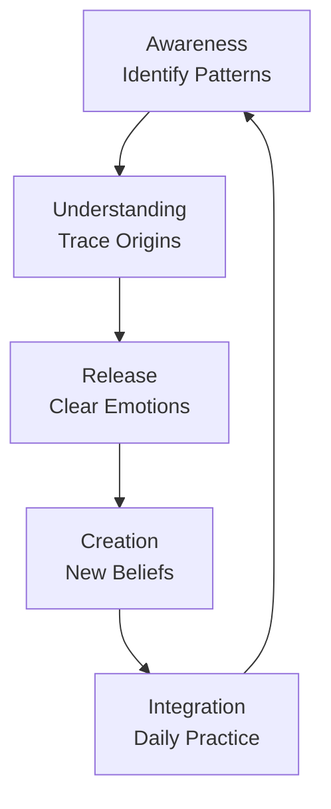
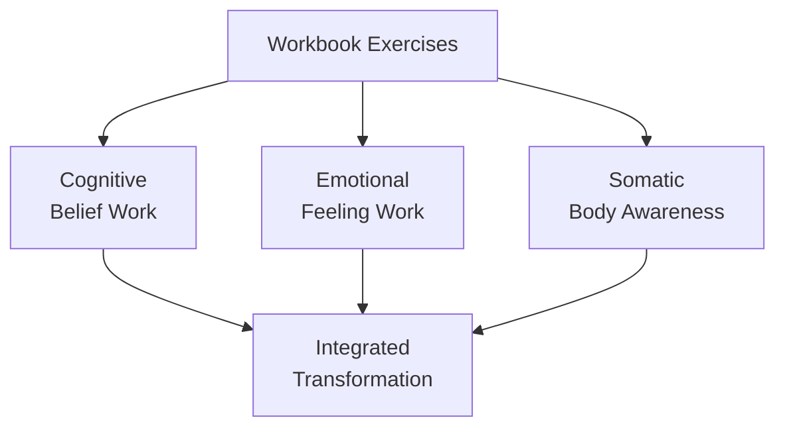

# Love Yourself, Heal Your Life Workbook (1990) - Book Summary

## 1. Executive Summary (Executive Audience)

"Love Yourself, Heal Your Life Workbook" (1990) by Louise Hay presents a practical, interactive guide to personal transformation through structured exercises designed to identify and release limiting beliefs while cultivating self-love. The central thesis argues that by systematically examining one's thoughts, emotions, and life patterns, individuals can consciously replace self-limiting programming with empowering beliefs, resulting in healing across all dimensions of life—physical, emotional, and relational. The book matters strategically for organizations and educational institutions because it provides a structured methodology for emotional intelligence development, stress reduction, and personal empowerment that can enhance individual performance, improve team dynamics, and reduce healthcare costs associated with stress-related conditions. The workbook format makes it particularly suitable for corporate training programs, wellness initiatives, and personal development workshops where measurable progress and accountability are valued.

- Originally published: 1990
- Multiple reprints and updated editions have been released over the years
- Part of Louise Hay's comprehensive body-mind healing series

## 2. Key Concepts (Deep Study Notes)

### The Workbook Methodology
This workbook uses interactive exercises, journaling prompts, and reflection questions to guide readers through a systematic process of self-discovery and transformation. Unlike passive reading, the workbook format requires active participation, which deepens learning and facilitates lasting change. For example, readers might be asked to write down their earliest childhood memory of feeling unworthy, then trace how that belief has influenced their adult life. This concept supports the book's central argument by providing the practical mechanism for identifying and changing limiting beliefs. The assumption is that active engagement through writing and reflection creates stronger neural pathways than passive reading alone.

### Identifying Limiting Beliefs
The workbook guides readers through specific exercises to uncover beliefs that may be operating beneath conscious awareness. These beliefs often originate in childhood experiences, family patterns, or traumatic events and continue to influence behavior and life outcomes automatically. For instance, an exercise might ask readers to complete the sentence "I am not good enough because..." multiple times to surface different variations of this limiting belief. This concept supports the book's thesis by providing the diagnostic tools necessary before transformation can occur. The author assumes that once beliefs are brought to conscious awareness, they can be consciously examined and changed.

### The Origin of Patterns
Hay emphasizes that current life patterns often reflect childhood programming. The workbook includes exercises to trace current difficulties back to their origins, helping readers understand that their present challenges may not be their fault but are the result of learned behaviors. For example, someone struggling with relationships might discover through workbook exercises that they learned to fear intimacy because of early experiences with unreliable caregivers. This concept supports the central argument by providing context and compassion for current struggles, reducing self-blame while opening the possibility for change. The implication is that understanding origins does not excuse behavior but provides the insight needed for transformation.

### Releasing Emotional Baggage
The workbook provides specific techniques for releasing stored emotions from past experiences. Unexpressed emotions create internal tension that manifests as physical symptoms, relationship difficulties, or life blocks. Hay includes exercises such as writing letters to people who caused hurt (without sending them), physically releasing emotions through safe expression, and using visualization to release emotional weight. For instance, readers might write an angry letter to a parent, then burn it symbolically to release the attached emotion. This concept supports the book's argument by addressing the emotional dimension that must be cleared before new patterns can be established.

### Creating New Affirmations
After identifying and releasing limiting beliefs, the workbook guides readers in creating personalized affirmations that support their desired life changes. Rather than using generic affirmations, readers are taught to craft statements that feel genuine and address their specific situations. For example, instead of a generic "I am wealthy," someone might create "I am worthy of financial abundance and manage money wisely." This concept supports the central thesis by providing the tool for establishing new neural pathways. The assumption is that personalized affirmations are more effective because they directly address the individual's specific limiting beliefs and feel more authentic.

## 3. Deep Study Notes

### The Structure of Personal Transformation

The workbook is designed to guide readers through a systematic process of transformation that mirrors the actual journey of personal growth. The progression moves from awareness to understanding to release to creation. This structured approach ensures that readers build capacity gradually rather than attempting advanced practices without foundational work. Each section builds upon previous sections, creating a comprehensive system rather than isolated techniques.

The author assumes that this sequential progression is necessary for lasting change. Skipping steps, such as attempting to create new beliefs without first releasing old ones, is likely to result in internal conflict and limited effectiveness. This assumption aligns with psychological understanding of behavior change, which emphasizes the importance of preparation and readiness before attempting new patterns. The implication is that transformation requires patience and systematic progression rather than quick fixes.

### The Role of Writing in Healing

The workbook format leverages the power of writing as a healing tool. Writing engages different cognitive processes than thinking alone, externalizes internal states, creates tangible records of progress, and facilitates emotional processing. When readers write about their experiences, they must organize thoughts, articulate feelings, and confront patterns that might remain vague in pure mental reflection.

Hay assumes that the act of writing itself is therapeutic and transformative. This assumption is supported by research on expressive writing, which has demonstrated benefits for physical health, emotional well-being, and immune function. The implication is that the workbook format is not merely convenient but actively contributes to the healing process through the mechanism of writing itself.

### The Integration of Cognitive, Emotional, and Somatic Work

The workbook engages multiple dimensions of the human being simultaneously. Cognitive work involves identifying beliefs, understanding patterns, and creating new mental frameworks. Emotional work involves feeling, expressing, and releasing stored emotions. Somatic work involves awareness of how patterns manifest in the body and using physical techniques to support release.

The author assumes that this multi-dimensional engagement is necessary for comprehensive healing. This assumption aligns with holistic healing traditions that address the whole person rather than isolated symptoms. The implication is that effective transformation must address multiple dimensions simultaneously rather than focusing on one aspect to the exclusion of others.

### The Importance of Personal Responsibility

Throughout the workbook, Hay emphasizes that readers are responsible for their own healing and growth. While the workbook provides tools and guidance, the actual work of transformation belongs to each individual. This perspective empowers readers while also placing responsibility on them for their outcomes. For example, exercises often ask readers to commit to specific actions and hold themselves accountable.

The author assumes that taking responsibility is empowering rather than burdensome. This assumption has important implications: it shifts the locus of control from external factors to internal choice, which research associates with better mental health outcomes. However, this assumption may overlook systemic factors that legitimately limit individual control, potentially leading to self-blame for circumstances beyond one's influence.

### The Balance of Compassion and Discipline

The workbook balances compassion for oneself and one's past with discipline in the present to create change. Hay teaches that self-criticism is counterproductive and that change requires self-acceptance. At the same time, consistent practice and honest self-examination are necessary for transformation. For instance, readers might be encouraged to be gentle with themselves about past patterns while being disciplined about daily affirmation practice.

The author assumes that compassion and discipline are complementary rather than contradictory. This assumption has important implications for the workbook's methodology: it prevents the harsh self-criticism that can sabotage change while maintaining the structure and consistency necessary for progress. The implication is that optimal change occurs when self-acceptance and personal responsibility are balanced.

## 4. Key Takeaways

- Active workbook exercises create stronger change than passive reading alone
- Limiting beliefs can be identified through systematic self-examination
- Current life patterns often reflect childhood programming that can be changed
- Writing is a therapeutic tool that facilitates emotional processing
- Emotional release is necessary before new patterns can be established
- Personalized affirmations are more effective than generic ones
- Transformation requires a systematic progression from awareness to creation
- Multi-dimensional engagement (cognitive, emotional, somatic) supports comprehensive healing
- Personal responsibility empowers individuals to create change
- Compassion and discipline must be balanced for sustainable transformation

## 5. Organization of the Book

The workbook is organized into thematic sections that guide readers through a progressive journey of self-discovery and transformation. The early sections focus on awareness and understanding—identifying limiting beliefs, tracing their origins, and understanding their impact. Middle sections focus on release—clearing emotional baggage, forgiving self and others, and letting go of what no longer serves. Later sections focus on creation—establishing new beliefs, practicing affirmations, and integrating new patterns into daily life.

Each section includes multiple exercises, reflection questions, and journaling prompts. The exercises vary in format to engage different learning styles and prevent monotony. Some exercises are analytical, requiring listing and categorization. Others are emotional, requiring expression of feelings. Still others are creative, requiring visualization or artistic expression. This variety supports the book's thesis by ensuring that readers can engage with the material in ways that resonate with their individual preferences and strengths.

The workbook format allows readers to track their progress visually by seeing their written responses accumulate over time. This tangible evidence of work can provide motivation and a sense of accomplishment. The structure also makes it possible to return to previous exercises for review or to repeat exercises as needed, supporting the ongoing nature of personal growth.

## 6. Chapter-Wise Breakdown

1. **Introduction to the Workbook**
   - Explanation of the workbook methodology and its benefits
   - How to use the book effectively for maximum benefit
   - Setting intentions for the transformation journey

2. **Discovering Your Beliefs**
   - Exercises to identify conscious and subconscious beliefs
   - Techniques for uncovering hidden thought patterns
   - Understanding how beliefs influence life outcomes

3. **Where Your Beliefs Came From**
   - Tracing beliefs to childhood experiences
   - Examining family patterns and cultural conditioning
   - Understanding the origin of self-limiting programming

4. **The Power of Your Thoughts**
   - How thoughts create reality
   - The impact of negative versus positive thinking
   - Exercises to monitor and shift thought patterns

5. **Loving Yourself**
   - The foundation of self-love for all healing
   - Overcoming self-criticism and self-rejection
   - Practical exercises for building self-acceptance

6. **Forgiving Yourself and Others**
   - The healing power of forgiveness
   - Releasing resentment and emotional baggage
   - Specific forgiveness exercises and processes

7. **Releasing the Past**
   - Letting go of what no longer serves
   - Techniques for clearing stored emotions
   - Creating space for new possibilities

8. **Creating Your Future**
   - Visualization techniques for desired outcomes
   - Setting intentions and goals
   - Aligning thoughts with desired reality

9. **Affirmations for Change**
   - Creating personalized affirmations
   - Daily affirmation practice
   - Using affirmations for specific life areas

10. **Health and Healing**
    - The mind-body connection in health
    - Identifying mental causes of physical symptoms
    - Affirmations for specific health conditions

11. **Prosperity and Abundance**
    - Limiting beliefs about money and success
    - Creating prosperity consciousness
    - Practical steps for financial well-being

12. **Relationships**
    - How self-perception affects relationships
    - Healing relationship patterns
    - Creating healthy connections

13. **Work and Career**
    - Finding meaning and purpose in work
    - Overcoming workplace challenges
    - Aligning career with authentic self

14. **Daily Practice**
    - Establishing a daily routine of self-care
    - Maintaining progress after the workbook
    - Ongoing practices for continued growth

15. **Conclusion and Celebration**
    - Reviewing the transformation journey
    - Celebrating progress and growth
    - Commitment to continued self-love practice
