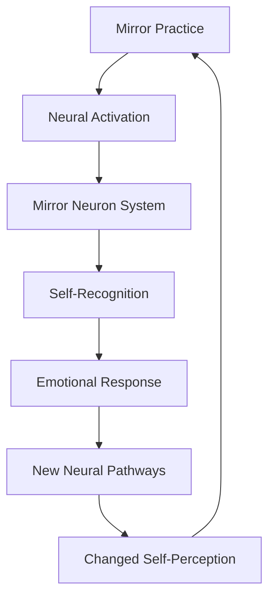
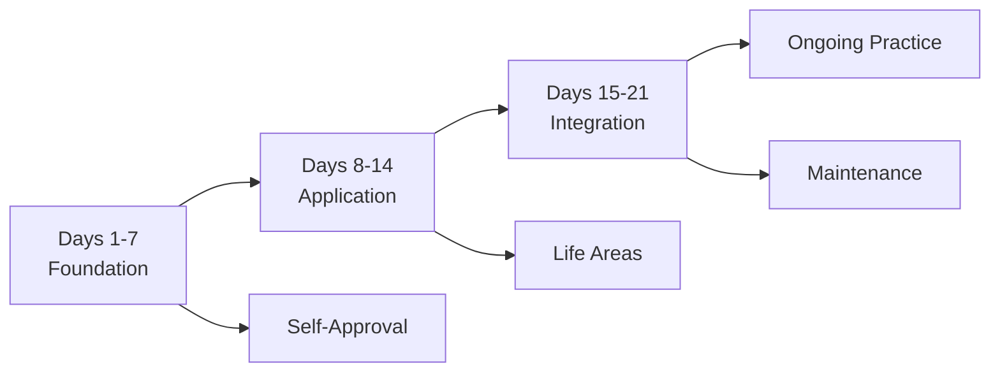
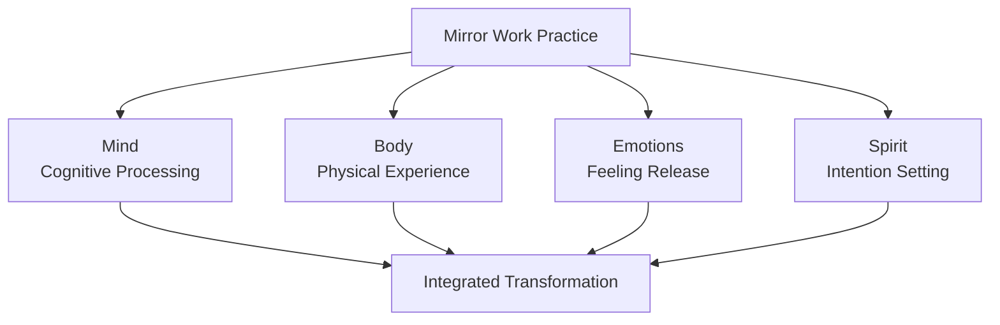

# Mirror Work: 21 Days to Heal Your Life - Book Summary

## 1. Executive Summary (Executive Audience)

"Mirror Work: 21 Days to Heal Your Life" by Louise Hay presents a structured 21-day program designed to transform self-perception and personal well-being through the practice of mirror work. The central thesis argues that looking at oneself in a mirror while speaking positive affirmations directly confronts and heals deep-seated self-rejection, gradually rebuilding self-love and creating lasting positive change in all areas of life. The book matters strategically for organizations because it offers a simple, low-cost intervention that can improve employee self-esteem, reduce stress, and enhance emotional resilience, potentially leading to improved workplace performance and reduced healthcare costs associated with stress-related illnesses. Published as a practical application of Hay's philosophy of self-love and mental healing, this work provides a systematic approach to personal transformation that can be implemented individually or in group settings.

## 2. Key Concepts (Deep Study Notes)

### The Mirror Technique
The mirror technique involves standing in front of a mirror, looking directly into one's own eyes, and speaking positive affirmations aloud. This practice creates a direct confrontation with one's relationship to oneself, revealing resistance, self-criticism, or emotional blocks that may otherwise remain hidden. For example, many people find it difficult to look themselves in the eye and say "I love you," which reveals underlying self-rejection. This concept supports the book's central argument by providing the primary tool for transformation. The direct, embodied nature of mirror work bypasses intellectual defenses and creates an immediate emotional experience that can shift deeply held beliefs about self-worth.

### The 21-Day Program Structure
The 21-day timeframe is based on the understanding that it takes approximately three weeks to establish new neural pathways and behavioral habits. Each day focuses on a specific theme, such as self-approval, forgiveness, prosperity, or health, with corresponding affirmations and exercises. This structured approach prevents overwhelm and allows for gradual, sustainable change. For instance, Day 1 might focus on "I approve of myself," while Day 7 might address "I forgive myself." This concept supports the book's thesis by providing a manageable, systematic progression that builds momentum and ensures comprehensive coverage of key life areas.

### Self-Approval as Foundation
Self-approval is presented as the antidote to self-criticism and the foundation for all positive change. Most people habitually criticize themselves, often without conscious awareness, which creates internal conflict and blocks personal growth. Hay teaches that self-approval is not about arrogance but about accepting oneself as worthy of love and respect simply because one exists. For example, instead of thinking "I'm not good enough," one practices thinking "I am worthy and deserving." This concept supports the central argument by addressing the root cause of many life challenges: lack of fundamental self-acceptance.

### The Connection Between Self-Perception and External Reality
The book argues that external circumstances mirror internal states. Those who love themselves attract loving relationships and opportunities. Those who criticize themselves attract criticism from others. This principle means that changing self-perception through mirror work will naturally change external life conditions. For instance, someone who practices self-approval may find that colleagues begin to treat them with more respect. This concept supports the thesis by explaining why internal work has external impact and providing motivation for the practice.

### Emotional Release Through Mirror Work
Looking in the mirror while speaking affirmations often triggers emotional release. Tears, anger, or sadness may surface as suppressed emotions are brought to conscious awareness. Hay explains that this release is healing and necessary for transformation. For example, someone might cry uncontrollably while saying "I forgive myself," releasing years of accumulated guilt. This concept supports the book's argument by demonstrating that mirror work is not merely cognitive but engages the emotional body, facilitating deep healing at the somatic level.

## 3. Deep Study Notes

### The Psychology of Mirror Neurons and Self-Recognition

The mirror technique leverages the brain's mirror neuron system, which activates when we observe others and also when we observe ourselves. Looking at oneself in the mirror creates a unique neurological state where we are both observer and observed simultaneously. This dual perspective allows for objective self-evaluation while maintaining emotional connection. The practice works by creating new neural pathways associated with self-acceptance rather than self-criticism.

Hay assumes that consistent mirror work can rewire neural patterns established over decades. This assumption aligns with contemporary research on neuroplasticity, which demonstrates that the brain remains malleable throughout life. The implication is that even deeply ingrained patterns of self-criticism can be transformed through consistent, focused practice. The book's 21-day structure provides the necessary repetition to initiate this neural reprogramming.

### The Progression of the 21-Day Journey

The program is designed to progress from foundational concepts to more complex applications. The early days focus on basic self-approval and acceptance, establishing a foundation of self-love. Middle days address specific life areas such as relationships, prosperity, and health, applying self-love to practical concerns. Later days integrate the lessons and focus on maintenance and continued growth.

This progression supports the book's thesis by ensuring that readers build capacity gradually. Starting with complex applications without foundational self-love would likely trigger resistance and overwhelm. The author assumes that this staged approach maximizes the likelihood of successful transformation. The implication is that personal change requires building capacity in stages rather than attempting everything at once.

### The Role of Resistance in Transformation

Resistance is presented as a natural part of the healing process. When beginning mirror work, many people experience strong resistance, including discomfort, skepticism, or even anger at the suggestion that they should love themselves. Hay explains that this resistance reveals the very patterns that need healing. For example, someone might feel angry when told to say "I love you" to their reflection, indicating deep-seated self-rejection.

The author assumes that resistance should be acknowledged but not allowed to stop the practice. This assumption has important implications: it normalizes discomfort as part of growth rather than interpreting it as evidence that the approach is wrong. The implication is that pushing through resistance with compassion is essential for breakthrough. The book provides specific guidance for working with resistance, including acknowledging feelings without judgment and continuing the practice despite discomfort.

### The Integration of Mind, Body, and Spirit

Mirror work engages all aspects of the human being simultaneously. The mind processes the affirmations cognitively. The body experiences the physical act of looking in the mirror and speaking. The emotions are activated as feelings surface. The spirit or consciousness is engaged through the intention of self-love. This holistic engagement creates more comprehensive transformation than mental work alone.

Hay assumes that this holistic engagement is necessary for lasting change. This assumption aligns with holistic healing traditions that address the whole person rather than isolated symptoms. The implication is that effective transformation must engage multiple dimensions of being simultaneously. The mirror technique naturally facilitates this integration through its embodied nature.

## 4. Key Takeaways

- Looking in the mirror while speaking affirmations directly confronts self-rejection
- The 21-day timeframe allows for establishing new neural pathways and behavioral habits
- Self-approval is the foundation for all positive life changes
- External circumstances reflect internal self-perception
- Emotional release during mirror work is healing and necessary
- Resistance is natural and reveals patterns that need healing
- Consistent practice is essential for lasting transformation
- Mirror work engages mind, body, emotions, and spirit simultaneously
- The program progresses from foundation to application to integration
- Self-love attracts loving relationships and positive life circumstances

## 5. Organization of the Book

The book is organized as a day-by-day guide for the 21-day program. Each day includes a specific theme, an explanation of why that theme matters, affirmations to practice, and sometimes additional exercises or reflections. The days are grouped into three phases: foundation (Days 1-7), application (Days 8-14), and integration (Days 15-21). This structure supports the book's thesis by providing a clear, actionable roadmap that readers can follow sequentially.

The introduction establishes the philosophy and methodology of mirror work, explaining why it works and how to approach the practice. The daily sections provide specific guidance for each day's focus, while the conclusion addresses maintenance and continued growth beyond the 21-day program. This organization allows the book to function both as a complete 21-day course and as a reference for ongoing practice. The progression from foundation to application to integration ensures that readers build capacity systematically rather than attempting advanced practices without preparation.

## 6. Chapter-Wise Breakdown

1. **Introduction to Mirror Work**
   - Explanation of what mirror work is and why it's powerful
   - The science behind the technique and its effectiveness
   - How to prepare for the 21-day journey

2. **Day 1: I Approve of Myself**
   - Establishing the foundation of self-approval
   - Overcoming resistance to self-love
   - Basic mirror work practice

3. **Day 2: I Am Safe**
   - Addressing fears and anxiety
   - Creating a sense of inner security
   - Affirmations for safety and protection

4. **Day 3: I Support Myself**
   - Learning to be one's own best friend
   - Moving away from self-criticism
   - Building internal support systems

5. **Day 4: I Love Myself**
   - Deepening the practice of self-love
   - Working through blocks to love
   - Experiencing genuine self-acceptance

6. **Day 5: I Trust Myself**
   - Building self-trust and confidence
   - Honoring one's inner wisdom
   - Making decisions from self-trust

7. **Day 6: I Express Myself**
   - Encouraging authentic self-expression
   - Overcoming fear of judgment
   - Speaking one's truth

8. **Day 7: I Accept Myself**
   - Radical self-acceptance without conditions
   - Releasing the need to be perfect
   - Embracing all aspects of oneself

9. **Day 8: I Forgive Myself**
   - The power of self-forgiveness
   - Releasing guilt and shame
   - Healing past mistakes

10. **Day 9: I Release the Past**
    - Letting go of what no longer serves
    - Living in the present moment
    - Creating space for the new

11. **Day 10: I Am Open to Change**
    - Embracing growth and transformation
    - Releasing resistance to change
    - Welcoming new possibilities

12. **Day 11: I Deserve the Best**
    - Challenging beliefs about unworthiness
    - Opening to receive abundance
    - Claiming one's deservingness

13. **Day 12: I Create My Life**
    - Taking responsibility for creation
    - Using thoughts and affirmations intentionally
    - Designing life by design

14. **Day 13: I Am Grateful**
    - The power of gratitude practice
    - Shifting focus to appreciation
    - Attracting more to be grateful for

15. **Day 14: I Am Healthy**
    - Affirmations for physical health
    - Mental patterns that support wellness
    - The mind-body connection

16. **Day 15: I Am Prosperous**
    - Addressing limiting beliefs about money
    - Creating prosperity consciousness
    - Abundance affirmations

17. **Day 16: I Am Loving**
    - Giving and receiving love freely
    - Healing relationship patterns
    - Being love in all situations

18. **Day 17: I Am Wise**
    - Accessing inner wisdom
    - Trusting intuition
    - Learning from experience

19. **Day 18: I Am Peaceful**
    - Cultivating inner peace
    - Releasing conflict and struggle
    - Being peace in the world

20. **Day 19: I Am Joyful**
    - Choosing joy as a practice
    - Finding happiness within
    - Spreading joy to others

21. **Day 20: I Am Free**
    - Releasing limitations and constraints
    - Experiencing true freedom
    - Living without conditions

22. **Day 21: I Am Complete**
    - Integrating all the lessons
    - Celebrating the journey
    - Committing to ongoing practice

23. **Conclusion and Maintenance**
    - How to continue the practice beyond 21 days
    - Dealing with setbacks and challenges
    - Creating a lifetime practice of self-love
