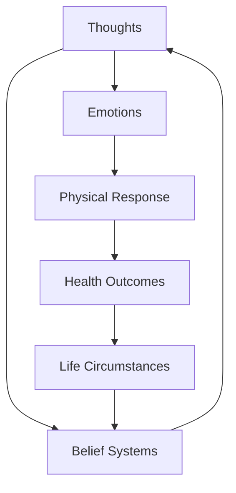
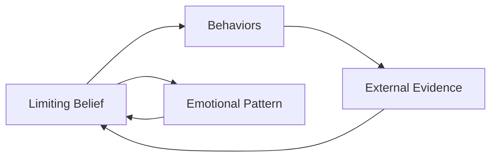
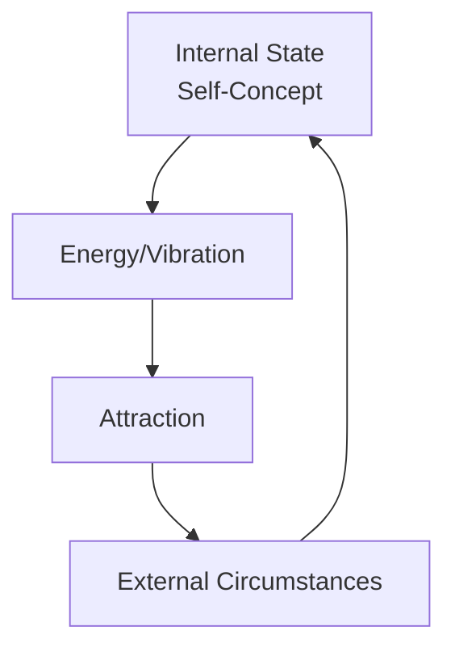

# The Power Is Within You (1991) - Book Summary

## 1. Executive Summary (Executive Audience)

"The Power Is Within You" (1991) by Louise Hay presents a comprehensive framework for personal transformation through the power of thought, affirmations, and self-love. The central thesis argues that our thoughts create our reality, and by consciously directing our mental patterns toward positivity and self-acceptance, individuals can heal emotional wounds, improve physical health, and create fulfilling lives. The book matters strategically for organizations because it offers a methodology for mindset transformation that can enhance employee well-being, reduce stress-related absenteeism, and foster a more resilient workforce. Published in 1991, this work emerged during the growing self-help movement and has since influenced countless individuals in their journey toward personal empowerment and holistic wellness.

## 2. Key Concepts (Deep Study Notes)

### Self-Healing Through Thought
This concept posits that the mind and body are interconnected, and negative thought patterns can manifest as physical illness or emotional distress. Hay explains that by identifying and changing these limiting beliefs, individuals can activate their innate self-healing capabilities. For example, chronic back pain might stem from feelings of unsupported or burdened by responsibilities. By addressing the underlying emotional pattern and replacing it with affirmations of support and ease, physical symptoms can improve. This concept supports the book's central argument by demonstrating the practical application of mind-body principles.

### The Power of Affirmations
Affirmations are positive statements repeated consciously to reprogram the subconscious mind. Hay teaches that consistent use of affirmations can override negative self-talk and establish new neural pathways that support desired outcomes. Examples include "I am worthy of love and happiness" or "My body is healthy and strong." These affirmations work by gradually shifting the individual's belief system from limitation to possibility. This concept is foundational to the book's methodology, providing the practical tool for implementing the broader philosophy of thought-creation.

### Childhood Origins of Limiting Beliefs
Hay identifies that most limiting beliefs originate in childhood experiences, particularly those involving criticism, rejection, or trauma. These early experiences create core beliefs about self-worth and capability that persist into adulthood unconsciously. For instance, a child frequently told they are "not good enough" may internalize this as a fundamental truth about themselves. Understanding these origins allows adults to trace current limitations to their source and consciously choose to release outdated patterns. This concept supports the book's argument by providing the diagnostic framework for identifying what needs to change.

### Forgiveness as Liberation
Forgiveness, in Hay's framework, is not about condoning harmful actions but about releasing the emotional burden carried by the forgiver. Holding onto resentment and anger creates internal toxicity that blocks healing and personal growth. Hay provides examples of how forgiving oneself and others, even for severe wrongs, frees energy for positive creation and emotional well-being. This concept supports the central thesis by removing internal obstacles to the power of positive thought.

### The Mirror Technique
The mirror technique involves looking at oneself in a mirror while speaking affirmations and expressions of self-love. This practice confronts individuals directly with their relationship to themselves and helps overcome resistance to positive self-talk. Hay explains that many people struggle to look themselves in the eye and say "I love you," revealing deep-seated self-rejection. This technique provides a practical method for building self-acceptance and supports the book's emphasis on direct, experiential transformation.

## 3. Deep Study Notes

### The Mind-Body Connection

The book establishes the fundamental premise that mental and emotional states directly influence physical health and life circumstances. Hay draws from both psychological research and metaphysical traditions to argue that thoughts are energy forms that interact with the body's cellular structure. Negative thoughts create tension and disease, while positive thoughts promote relaxation and healing. This connection operates through the nervous system, which responds to mental imagery and emotional states by releasing corresponding hormones and neurotransmitters.

The author assumes that individuals have significant control over their health and life outcomes through mental discipline. This assumption has important implications: it places responsibility for healing on the individual while potentially overlooking systemic factors such as genetics, environmental toxins, or socioeconomic conditions that also affect health. However, within the scope of personal empowerment, this framework offers a proactive approach to wellness.

### The Structure of Limiting Beliefs

Limiting beliefs operate through self-reinforcing cycles. A negative belief about oneself (e.g., "I am unlovable") leads to behaviors that confirm the belief (withdrawing from relationships, rejecting affection), which then produces external evidence that seems to validate the original belief. Hay explains that these cycles can span generations as patterns are passed down through family systems.

Breaking these cycles requires simultaneous work at the cognitive, emotional, and behavioral levels. Cognitive work involves identifying and challenging the belief. Emotional work involves feeling and releasing the associated pain. Behavioral work involves taking new actions that contradict the old pattern. The book provides specific techniques for each level of intervention.

### The Role of the Subconscious

Hay distinguishes between conscious and subconscious mental processes. The conscious mind handles immediate decisions and logical thinking, while the subconscious stores deeper beliefs, emotional memories, and automatic responses. Most of our behavior and emotional reactions are driven by subconscious programming rather than conscious choice. Affirmations work by gradually influencing the subconscious through repetition and emotional engagement.

The author assumes that the subconscious can be reprogrammed through consistent practice, a view supported by contemporary neuroscience research on neuroplasticity. However, the book may oversimplify the complexity of deeply entrenched trauma patterns that may require professional therapeutic intervention beyond self-help techniques.

### The Relationship Between Self-Love and External Reality

The book argues that external circumstances reflect internal states. Those who love themselves attract loving relationships and opportunities. Those who criticize themselves attract criticism from others. This principle, sometimes called the "law of attraction," suggests that the universe mirrors our internal reality back to us.

This framework has significant implications for personal responsibility but also raises questions about victim-blaming for those experiencing hardship. Hay attempts to address this by emphasizing that changing internal states is a gradual process and that current circumstances reflect past programming, not current conscious intent.

## 4. Key Takeaways

- Thoughts and beliefs directly influence physical health, emotional well-being, and life circumstances
- Limiting beliefs often originate in childhood experiences and can be identified and consciously changed
- Affirmations are practical tools for reprogramming the subconscious mind with positive patterns
- Self-love is the foundation for all positive change and healing
- Forgiveness releases emotional baggage that blocks personal growth and health
- The mirror technique provides a direct method for confronting and transforming self-rejection
- Physical symptoms often have emotional and psychological components that can be addressed through mental work
- Consistent practice is essential for lasting change; affirmations require regular repetition
- The journey of self-transformation is ongoing and requires patience and compassion with oneself
- External reality reflects internal state; changing the internal changes the external

## 5. Organization of the Book

The book is structured to guide readers progressively from understanding the philosophy to practical application. It begins with foundational concepts about the power of thought and the mind-body connection, establishing the theoretical framework. The middle sections provide diagnostic tools for identifying limiting beliefs and understanding their origins in childhood and past experiences. The latter portions focus heavily on practical techniques including affirmations, the mirror work, forgiveness practices, and specific guidance for addressing common issues such as relationships, health, and prosperity.

This structure supports the overall thesis by moving from understanding to application. Readers first learn why change is possible and necessary, then learn to identify what needs to change, and finally receive specific tools for implementing change. The progression mirrors the actual journey of personal transformation: awareness, understanding, and action. Each section builds upon previous knowledge, creating a comprehensive system rather than isolated techniques.

## 6. Chapter-Wise Breakdown

1. **The Power of Thought**
   - Thoughts are creative forces that shape reality
   - The subconscious mind stores and acts upon our dominant beliefs
   - Negative thought patterns can be consciously identified and changed

2. **The Mind-Body Connection**
   - Physical health reflects mental and emotional states
   - Specific emotional patterns correlate with specific health issues
   - Healing the mind supports healing the body

3. **Where Do Our Beliefs Come From?**
   - Childhood experiences form the foundation of adult belief systems
   - Family patterns and cultural conditioning shape self-perception
   - Past traumas create ongoing limiting beliefs until consciously addressed

4. **The Mirror Technique**
   - Looking in the mirror while speaking reveals one's true relationship with oneself
   - Many people struggle to make eye contact with themselves
   - Regular mirror practice builds self-acceptance and authentic self-expression

5. **Loving Yourself**
   - Self-love is the foundation for all positive change
   - Self-criticism creates internal conflict and blocks healing
   - Practical exercises for developing genuine self-acceptance

6. **Your Point of Power**
   - The present moment is the only point of creative power
   - Dwelling on the past or worrying about the future disempowers
   - Conscious choice in the present creates future circumstances

7. **Forgiveness**
   - Forgiveness releases the forgiver, not just the forgiven
   - Holding resentment harms the holder more than the offender
   - Forgiving oneself is often more difficult than forgiving others

8. **Creating Your Future**
   - Visualization combined with emotion creates future outcomes
   - Clear intentions aligned with positive emotion attract desired results
   - The universe responds to the energy we emit

9. **Prosperity**
   - Limiting beliefs about money block financial abundance
   - Prosperity consciousness attracts material wealth
   - Generosity and gratitude amplify prosperity

10. **Work and Career**
    - Work should be an expression of creativity and service
    - Negative attitudes about work create workplace difficulties
    - Finding meaning in work transforms the experience

11. **Relationships**
    - Our relationships mirror our relationship with ourselves
    - Self-love attracts loving relationships
    - Healthy boundaries require self-respect

12. **Health and Healing**
    - The body has innate self-healing capabilities
    - Mental and emotional work supports physical healing
    - Specific affirmations for common health conditions

13. **The Body Speaks**
    - Different body parts correspond to different emotional issues
    - Symptoms in specific areas indicate underlying emotional patterns
    - Addressing the emotional pattern can alleviate physical symptoms

14. **Moving Forward**
    - Personal transformation is an ongoing journey, not a destination
    - Consistency in practice yields cumulative results
    - Each individual's path is unique and unfolds in its own timing
