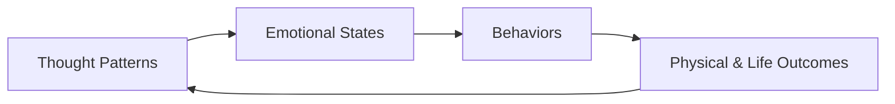

# 📘 *You Can Heal Your Life* — Louise L. Hay

***

## 1. Executive Summary (Executive Audience)

*You Can Heal Your Life* presents a powerful, psychologically oriented thesis: **our thoughts, beliefs, and emotional patterns significantly shape our physical health, relationships, and life outcomes**. Louise Hay argues that many chronic struggles—especially illness and emotional distress—stem from deeply ingrained patterns of self‑criticism, guilt, fear, and lack of self‑love. By consciously changing these inner patterns, individuals can foster healing and personal transformation.

For leaders and executives, the book matters because it reframes **human performance, resilience, and well‑being** as outcomes of mindset and self‑relationship. Its strategic relevance lies in highlighting how internal narratives influence behavior, stress response, decision‑making, and long‑term effectiveness. While not a medical manual, the book offers a foundational mental model for sustainable personal change, emotional intelligence, and self‑directed growth.

***

## 2. Key Concepts (Deep Study Notes)

### 🌱 1. The Thought–Body Connection

**Concept:** Mental and emotional patterns influence physical health.\
**Explanation:** Hay proposes that persistent emotional states (such as resentment, fear, or self‑hatred) manifest over time as physical illness. Illness is seen as a signal rather than an enemy.\
**Examples:**

*   Chronic resentment linked to inflammation
*   Fear associated with kidney disorders (as per Hay’s metaphysical interpretation)\
    **Support to Central Argument:** Establishes the foundation that healing must begin internally, not only externally.

***

### 💭 2. Limiting Beliefs and Conditioning

**Concept:** Many problems originate from unconscious beliefs formed in childhood.\
**Explanation:** Early experiences—especially with caregivers—shape beliefs about worth, safety, and love. These beliefs unconsciously drive adult behavior and emotional reactions.\
**Examples:**

*   “I am not good enough” leading to self‑sabotage
*   Fear of abandonment shaping relationships\
    **Support to Central Argument:** Explains why awareness and belief‑change are essential for healing.

***

### 💖 3. Self‑Love as the Central Healer

**Concept:** Self‑love is the most important ingredient in healing.\
**Explanation:** Hay asserts that criticism and self‑rejection are at the root of most suffering, while self‑approval creates psychological safety for change.\
**Examples:**

*   Mirror work: affirming self‑acceptance while looking at oneself\
    **Support to Central Argument:** Positions self‑love as the common denominator across mental, emotional, and physical health.

***

### 🗣️ 4. Affirmations as Tools for Change

**Concept:** Affirmations retrain subconscious belief systems.\
**Explanation:** Repeated positive statements counter old mental programming and create new neural and emotional patterns.\
**Examples:**

*   “I approve of myself.”
*   “I am safe.”\
    **Support to Central Argument:** Provides a practical method for transforming thought patterns.

***

### 🧘 5. Willingness to Change

**Concept:** Healing requires openness rather than force.\
**Explanation:** Change cannot happen through self‑punishment; it requires compassion and willingness. Resistance often sustains illness or stagnation.\
**Examples:**

*   Asking: “Am I willing to release this pattern?”\
    **Support to Central Argument:** Emphasizes agency and non‑judgmental awareness.

***

## 3. Deep Study Notes

### The Core Healing Model

Louise Hay’s work rests on a **circular rather than linear** model of change:

Negative cycles (e.g., self‑criticism → guilt → stress → illness) reinforce themselves unless consciously interrupted.

***

### Key Assumptions

*   The mind and body are inseparable.
*   Individuals are not victims of illness but participants in their healing.
*   Awareness + compassion enables change.
*   The present moment is where healing occurs.

***

### Implications

*   Blame is replaced with responsibility (without moral judgment).
*   Healing becomes a life‑long relational process with oneself.
*   Psychological safety accelerates growth more effectively than discipline alone.

***

### Integration of Ideas

*   **Beliefs create experiences**
*   **Self‑love dissolves resistance**
*   **Affirmations re‑pattern beliefs**
*   **Willingness activates transformation**

Together, these form a self‑reinforcing positive cycle.

***

## 4. Key Takeaways

*   Thoughts are habitual—and habits can be changed.
*   Self‑criticism blocks growth; self‑acceptance enables it.
*   Healing begins with awareness, not blame.
*   Affirmations work through repetition and emotional sincerity.
*   Willingness matters more than perfection.
*   External change follows internal realignment.

***

## 5. Organization of the Book

The book progresses logically from **awareness → understanding → practice**:

1.  **Foundational Philosophy** – How thoughts and beliefs shape reality
2.  **Emotional Roots of Illness** – Linking mental patterns and physical symptoms
3.  **Self‑Love and Forgiveness** – The emotional core of healing
4.  **Practical Tools** – Affirmations, mirror work, and exercises
5.  **Integration** – Applying principles to health, relationships, and life

The structure guides readers from conceptual understanding to actionable self‑work.

***

## 6. Chapter‑Wise Breakdown

*(Titles are inferred where exact titles vary across editions)*

### 1. Introduction: The Philosophy of Healing

*   Thoughts create experiences
*   Mind–body unity
*   Healing as a process

### 2. The Power of Thought

*   Conditioning and belief systems
*   Repetition of mental patterns

### 3. Criticism and Its Effects

*   Self‑criticism as the root of suffering
*   Inner dialogue awareness

### 4. Loving the Self

*   Meaning and practice of self‑love
*   Mirror work introduction

### 5. The Mechanics of Affirmations

*   Why affirmations work
*   How to use them effectively

### 6. Willingness and Resistance

*   Resistance as protection
*   Compassion over force

### 7. Emotional Patterns and Illness

*   Metaphysical interpretations of disease
*   Emotional awareness

### 8. Releasing the Past

*   Forgiveness as freedom
*   Letting go of resentment

### 9. Creating a New Future

*   Choosing empowering beliefs
*   Daily practice of awareness

### 10. Living the Healing Life

*   Integration into relationships, work, and health
*   Life as an ongoing healing journey

***

🌈 **End of Structured Summary**
