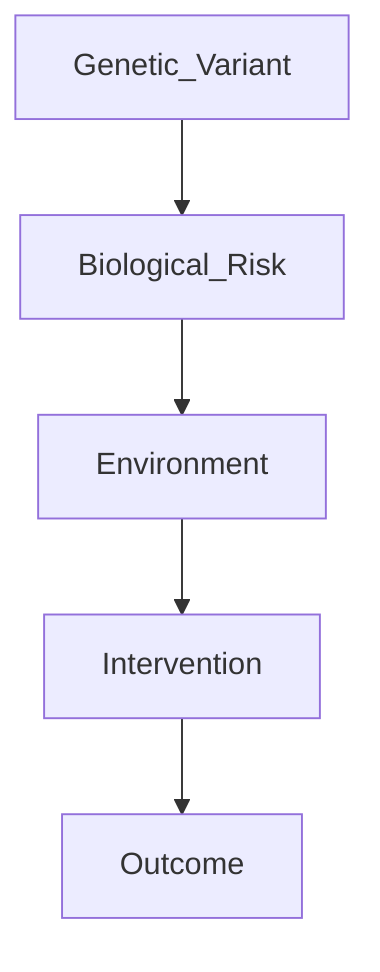
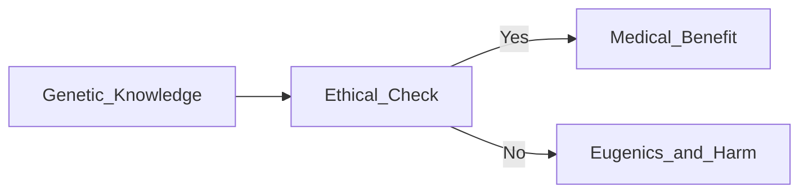
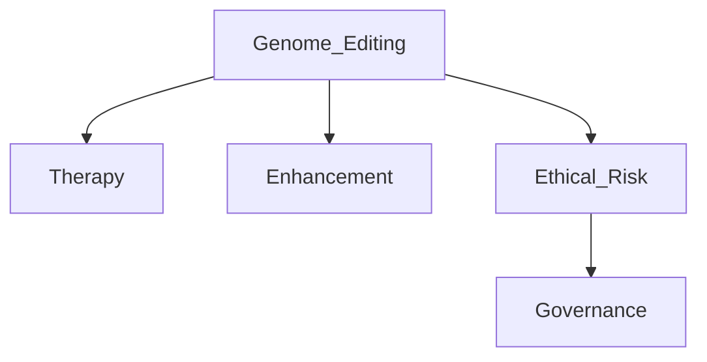

# The Gene: An Intimate History — Reference Summary
Author: Siddhartha Mukherjee  
Genre: Science, Genetics, History of Medicine  
Publication Year: 2016  

---

## DNA as the Language of Life

Mukherjee presents DNA as an information system rather than a mystical essence of life.

- DNA stores biological instructions using four nucleotide bases
- RNA acts as an intermediary
- Proteins execute cellular and physiological functions
- Traits emerge from systems of genes, not single genes

Key point: Life is governed by information interpreted through biological machinery.

---

## Genes, Disease, and Probability

Genes influence disease by altering probability, not by guaranteeing outcomes.

- Single‑gene diseases: cystic fibrosis, Huntington’s disease
- Polygenic traits: height, intelligence, mental illness
- Cancer: accumulation of somatic genetic mutations
- Mental illness: genetic vulnerability shaped by environment

Mukherjee uses his family’s history of schizophrenia to show variability in expression.

### Core Principle
> Genes influence probability, not destiny.

---

## The Dark History of Genetics: Eugenics

The book documents how genetics was historically misused:

- Forced sterilization programs in the US and Europe
- Biological justification of racism
- Nazi racial hygiene ideology

Eugenics emerged from partial science combined with moral arrogance.

Key lesson: Science without ethics becomes ideology.

---

## Genes, Identity, and the Limits of Reductionism

Mukherjee rejects simplistic claims such as:

- “There is a gene for intelligence”
- “There is a gene for criminality”
- “There is a gene for personality”

Reality:
- Most traits are polygenic
- Expression is context‑dependent
- Identity cannot be decoded from DNA

Key point: Reductionism fails when applied to human complexity.

---

## The Genomic Revolution and CRISPR

Modern genetics enables direct genome manipulation.

- Gene correction for inherited disease
- Possibility of human enhancement
- Germline editing affects future generations

Critical questions:
- Who decides what is “normal”?
- Should future generations be edited?
- Will genetic privilege increase inequality?

---

## Structural Organization of the Book

| Part | Focus |
|----|----|
| Part I | Classical genetics and heredity |
| Part II | DNA and molecular biology |
| Part III | Genes and disease |
| Part IV | Eugenics and misuse |
| Part V | Genomics and the future |

---

## Writing Style and Methodology

- Narrative scientific history
- Biographies of scientists and patients
- Case studies blended with memoir
- Ethical analysis embedded, not appended

Strengths:
- Humanizes complex science
- Integrates ethics naturally
- Connects past mistakes to future risks

Limitations:
- Technically dense in places
- Requires careful reading

---

## Why This Book Matters

The book reframes how we think about:

- Health and disease
- Identity and agency
- Inequality and access
- Technological responsibility

It is especially relevant to:
- Biotechnology and AI leaders
- Policy makers
- Engineers designing future systems

---

## Chapter‑Wise Breakdown (Conceptual)

### Chapters 1–5: Origins of Heredity
- Mendel’s laws
- Discrete inheritance
- Early resistance to genetics

### Chapters 6–10: DNA and Molecular Biology
- Structure of DNA
- Central dogma
- Information theory in biology

### Chapters 11–14: Genes and Disease
- Cancer genetics
- Mental illness
- Risk vs fate

### Chapters 15–18: Eugenics
- Forced sterilization
- Scientific racism
- Ethical collapse

### Chapters 19–22: Genomics and the Future
- Human Genome Project
- CRISPR
- Moral and societal implications

---

## One‑Page Executive Brief

**What this book is:**  
A complete scientific, historical, and ethical biography of the gene.

**Core insight:**  
Genes matter deeply, but they do not define destiny.

**Strategic relevance:**  
Warns against technological determinism and emphasizes ethical governance alongside innovation.

**Bottom line:**  
The future of genetics — like AI — will be decided not by capability, but by values.

---

## Final Statement

Understanding the gene is not about perfection.  
It is about responsibility.
``
