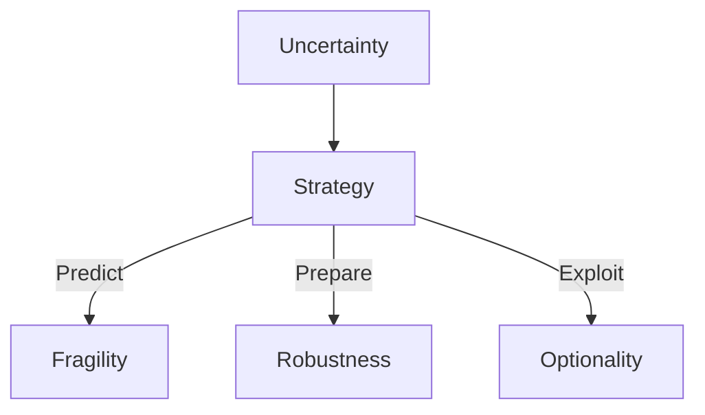

# The Black Swan: The Impact of the Highly Improbable
**Author:** Nassim Nicholas Taleb

---

## 1. Executive Summary (Executive Audience)

**The Black Swan** explores how rare, unpredictable, high‑impact events—which Nassim Nicholas Taleb calls *Black Swans*—shape history, markets, technology, and personal outcomes far more than we typically acknowledge. Taleb argues that humans systematically underestimate the likelihood and impact of extreme events because we rely on fragile models, linear thinking, and hindsight-biased explanations. As a result, organizations and leaders are often blindsided by shocks they believed were impossible.

Strategically, the book matters because it reframes risk, uncertainty, and decision‑making in complex systems. Rather than trying (and failing) to predict rare events, Taleb urges leaders to build robustness and upside exposure—designing systems that can survive volatility and benefit from positive Black Swans. This perspective has major implications for strategy, finance, innovation, policy, and leadership in an increasingly unpredictable world.

- **First published:** 2007  
- **Expanded second edition:** 2010 (with additional essays and reflections)

---

## 2. Key Concepts (Deep Study Notes)

### 1. Black Swan Events
**Explanation:**  
A Black Swan is an event that:
1. Is an outlier beyond regular expectations  
2. Has an extreme impact  
3. Is rationalized after the fact as if it were predictable  

**Examples:**  
- The 9/11 attacks  
- The collapse of major financial institutions  
- The sudden success of companies like Google or YouTube  

**Support for Central Argument:**  
These events dominate outcomes in history and economics, yet traditional models fail to account for them.

---

### 2. The Problem of Induction
**Explanation:**  
Induction assumes the future will resemble the past. Taleb argues this logic collapses in domains where rare events dominate outcomes.

**Example:**  
Observing a turkey fed daily leads it to expect food—until Thanksgiving.

**Support:**  
Demonstrates how stability can mask hidden risk and sudden collapse.

---

### 3. Mediocristan vs. Extremistan
**Explanation:**  
Taleb divides domains into two statistical worlds:
- **Mediocristan:** Outcomes cluster around the average; extremes matter little.
- **Extremistan:** A few extreme events dominate totals.

**Examples:**  
- Height (Mediocristan)  
- Wealth distribution (Extremistan)

**Support:**  
Shows why Gaussian (normal) models fail in finance, economics, and social systems.

---

### 4. Narrative Fallacy
**Explanation:**  
Humans impose coherent stories on complex reality, mistaking explanation for understanding.

**Example:**  
Post‑crisis explanations that claim financial crashes were “obvious” in hindsight.

**Support:**  
Explains why people feel confident despite poor predictive abilities.

---

### 5. Epistemic vs. Aleatory Uncertainty
**Explanation:**  
- **Epistemic uncertainty:** Due to what we don’t know (model ignorance).  
- **Aleatory uncertainty:** Due to inherent randomness.

**Support:**  
Taleb argues most risk comes from epistemic ignorance we fail to acknowledge.

---

### 6. Antifragility (Introduced Conceptually)
**Explanation:**  
Although fully developed in a later book, Taleb contrasts fragile systems with those that benefit from volatility.

**Support:**  
Reinforces the idea of positioning for uncertainty rather than predicting outcomes.

---

## 3. Deep Study Notes

### The Illusion of Predictability
Taleb argues that modern society overestimates its ability to forecast complex systems. Statistical elegance hides model fragility, especially where extreme outcomes dominate.

***

### Knowledge vs. Ignorance
The book emphasizes that information can increase error when it creates overconfidence. More data does not necessarily equal better foresight.
Assumption:
Human cognition is poorly adapted to nonlinear, fat‑tailed environments.
Implication:
Experts may be more dangerous than amateurs when they mistake precision for accuracy.

### Robustness Over Forecasting
Taleb recommends replacing prediction with structural resilience:
Reduce downside exposure
Increase optionality
Avoid ruin at all costs

### 4. Key Takeaways

Rare events shape history more than averages
Prediction is less valuable than preparation
Extreme outcomes invalidate normal statistical assumptions
Narratives create false confidence
Avoid strategies with catastrophic downside
Seek asymmetry: limited downside, unlimited upside
Respect uncertainty instead of explaining it away

### 5. Organization of the Book
The book progresses from philosophical foundations to practical implications. It begins by challenging how humans think about knowledge and probability, then moves into statistical and cognitive errors. Finally, it applies these insights to finance, history, and real‑world decision‑making. Each section deepens the reader’s understanding of uncertainty and exposes the fragility of conventional thinking.

### 6. Chapter‑Wise Breakdown

Prologue – Umberto Eco’s Antilibrary

Knowledge grows faster than what we know
Importance of unseen information
Respecting what we do not understand

Chapter 1 – The Apprenticeship of an Empirical Skeptic

Taleb’s intellectual background
Experience with randomness
Skepticism toward theory

Chapter 2 – Yevgenia’s Black Swan

Definition of Black Swan events
Rare but transformative phenomena
Limits of expectation

Chapter 3 – The Speculator and the Prostitute

Asymmetry of outcomes
Hidden risks in stable income
Importance of payoff distribution

Chapter 4 – One Thousand and One Days

Turkey problem
False sense of security
Sudden collapse models

Chapter 5 – Confirmation Shmconfirmation!

Confirmation bias
Filtering disconfirming evidence
Fragility of belief systems

Chapter 6 – The Narrative Fallacy

Storytelling bias
Oversimplification of causality
Mistaking clarity for truth

Chapter 7 – Living in the Antechamber of Hope

Overestimation of skill
Underestimation of luck
Survivorship bias

Chapter 8 – Giacomo Casanova’s Unfailing Luck

Role of randomness in success
Long sequences of chance
Misinterpreting outcomes

Chapter 9 – Too Much Information

Noise vs. signal
Media distortion
Overreaction to data

Chapter 10 – The Scandal of Prediction

Failure of economic forecasting
Expert overconfidence
Structural blindness

Chapter 11 – Epistemocracy, a Dream

Limits of centralized knowledge
Distributed uncertainty
Policy implications

Chapter 12 – The Black Swan of Probability

Fat tails
Non‑Gaussian distributions
Mathematical misunderstandings

Chapter 13 – The Fourth Quadrant

Decision‑making under ignorance
Practical humility
Designing resilient systems
