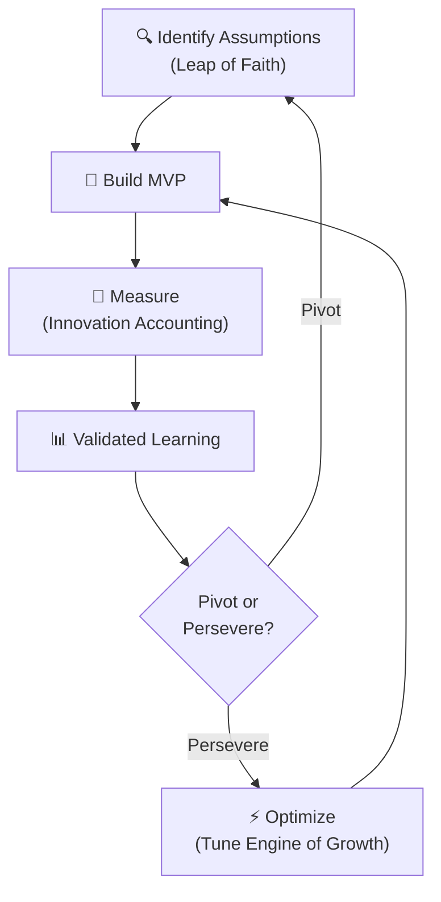
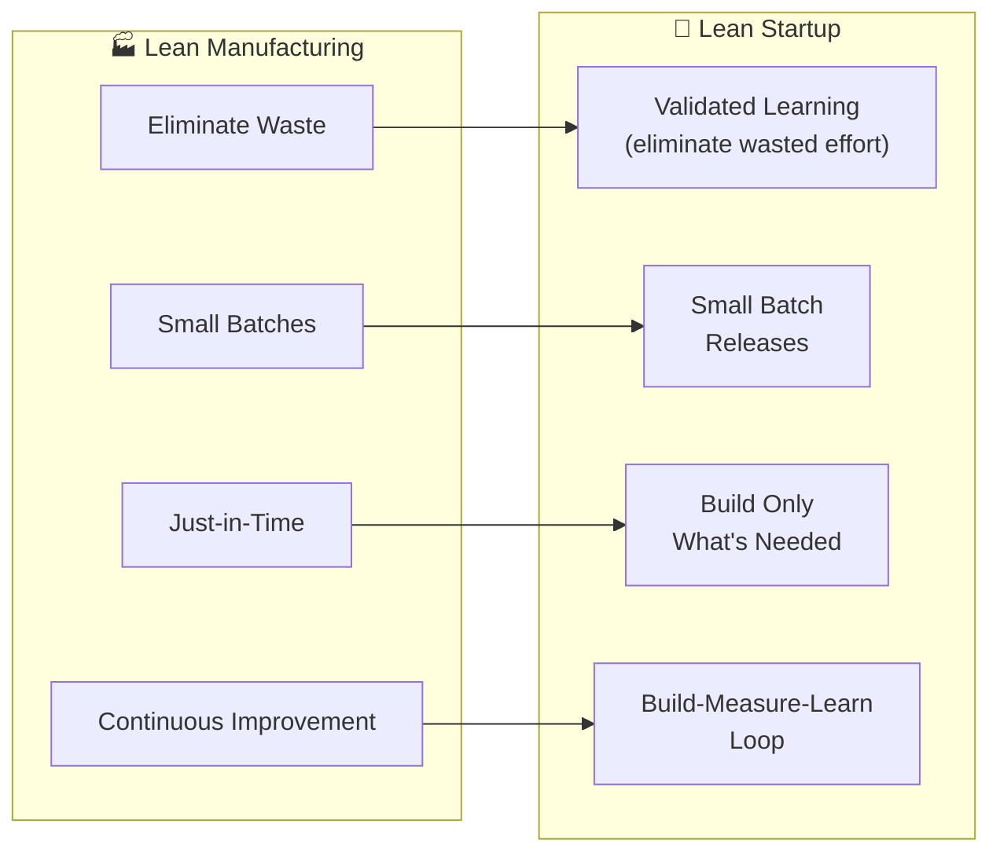

# 🚀 The Lean Startup — Book Summary

**📖 Title:** The Lean Startup  
**✍️ Author:** Eric Ries  
**📅 Published:** 2011

---

## 1. 📊 Executive Summary (Executive Audience)

The Lean Startup presents a systematic, scientific methodology for building and managing startups in conditions of extreme uncertainty. Eric Ries argues that the traditional approach to launching businesses — writing detailed business plans, raising capital, and executing on a fixed vision — is fundamentally flawed because it assumes founders can predict what customers want before delivering a product. Instead, Ries proposes a cycle of **Build-Measure-Learn** that treats every product decision as a hypothesis to be tested, measured, and validated through direct customer feedback. The result is a framework that reduces waste, shortens development cycles, and increases the probability of building something customers actually want.

For senior leaders, this book matters because its principles apply far beyond garage startups. Large enterprises, government agencies, and established organizations all face the challenge of innovating under uncertainty. The Lean Startup methodology provides a disciplined approach to managing innovation portfolios, allocating resources efficiently, and making data-driven decisions about whether to persevere with a strategy or pivot to a new direction. Organizations that adopt these principles reduce the risk of building products nobody wants and accelerate their path to sustainable growth.

---

## 2. 🔑 Key Concepts (Deep Study Notes)

### 🔄 Build-Measure-Learn Feedback Loop

The core engine of the Lean Startup methodology. Instead of spending months or years building a complete product, entrepreneurs should build a **minimum viable product (MVP)**, measure how customers respond using **actionable metrics**, and learn whether to **pivot** or **persevere**.

> 🟢 **Example:** Ries describes how at IMVU (his startup), the team initially built an instant messaging add-on. When metrics showed users didn't want it integrated into existing IM clients, they pivoted to a standalone 3D social network — a decision driven by measured customer behavior, not assumptions.

**Supports central argument:** This loop replaces speculative planning with empirical learning, directly addressing the problem of uncertainty.

### 🧪 Minimum Viable Product (MVP)

The MVP is the version of a new product that allows a team to collect the maximum amount of **validated learning** about customers with the **least effort**. It is not a minimal product — it is the fastest way to get through the Build-Measure-Learn loop.

> 🟢 **Example:** Dropbox created a simple 3-minute video demonstrating how the product would work before building it. Sign-ups jumped from 5,000 to 75,000 overnight — validating demand without writing a single line of production code.

> 🟢 **Example:** Zappos founder Nick Swinmurn tested whether people would buy shoes online by photographing shoes at local stores and posting them online. When orders came in, he bought the shoes at retail and shipped them. No inventory, no warehouse — just a hypothesis test.

**Supports central argument:** The MVP eliminates waste by testing assumptions before committing resources to full development.

### 📏 Innovation Accounting

A rigorous system for measuring progress in a startup. Traditional accounting (revenue, profit) is meaningless for early-stage ventures. Innovation accounting uses three steps:

1. **Establish the baseline** — Use an MVP to gather real data on current performance
2. **Tune the engine** — Make changes aimed at improving metrics toward the ideal
3. **Pivot or persevere** — Decide whether the current strategy is working

> 🟢 **Example:** Ries describes how IMVU used cohort analysis rather than vanity metrics. Instead of tracking total registered users (which only goes up), they tracked conversion rates and revenue per customer per cohort — metrics that revealed whether product changes actually improved outcomes.

**Supports central argument:** Innovation accounting provides the measurement framework that makes the Build-Measure-Learn loop actionable and honest.

### 🔀 Pivot

A structured course correction designed to test a new fundamental hypothesis about the product, strategy, or engine of growth — without starting from scratch. A pivot is not a random change; it is a strategic decision informed by validated learning.

**Types of pivots identified by Ries:**
- 🔸 **Zoom-in Pivot** — A single feature becomes the whole product
- 🔸 **Zoom-out Pivot** — The whole product becomes a single feature of a larger product
- 🔸 **Customer Segment Pivot** — Same product, different target audience
- 🔸 **Customer Need Pivot** — Same customer, different problem
- 🔸 **Platform Pivot** — Change from application to platform or vice versa
- 🔸 **Business Architecture Pivot** — Switch between high-margin/low-volume and low-margin/high-volume
- 🔸 **Value Capture Pivot** — Change the monetization model
- 🔸 **Engine of Growth Pivot** — Switch between sticky, viral, or paid growth engines
- 🔸 **Channel Pivot** — Change the distribution mechanism
- 🔸 **Technology Pivot** — Achieve the same solution with different technology

**Supports central argument:** Pivoting is the mechanism that prevents startups from persisting with failed strategies while preserving accumulated learning.

### 📐 Validated Learning

Learning that is demonstrated by **measurable improvements in core metrics**, not by anecdotes, opinions, or narratives. Validated learning is the unit of progress in a Lean Startup.

> 🟢 **Example:** At IMVU, instead of asking customers what they wanted through surveys, the team released product changes and measured whether customer behavior actually changed. Learning was only considered "validated" if metrics moved.

**Supports central argument:** Validated learning replaces faith-based decision-making with evidence-based decision-making.

### ⚡ Engines of Growth

Ries identifies three engines that drive sustainable startup growth:

- 🟡 **Sticky Engine** — Focuses on retaining customers. Growth comes from high retention rates exceeding churn. Key metric: customer attrition rate.
- 🟡 **Viral Engine** — Existing customers drive new customer acquisition through normal product use. Key metric: viral coefficient (must exceed 1.0).
- 🟡 **Paid Engine** — Growth through paid customer acquisition. Key metric: customer lifetime value (LTV) must exceed customer acquisition cost (CAC).

> 🟢 **Example:** Hotmail grew virally by appending "Get your free email at Hotmail" to every outgoing message. Tupperware used a viral engine through party-based selling.

**Supports central argument:** Understanding your engine of growth allows you to focus metrics and experiments on the right levers.

### 🏗️ Small Batches

Ries argues for working in **small batches** rather than large ones. Instead of completing all design, then all development, then all testing — work on small increments end-to-end.

> 🟢 **Example:** Ries uses the envelope-stuffing analogy. Intuition says it's faster to fold all letters, then stuff all envelopes, then seal all. But experiments show it's actually faster to complete each envelope one at a time — because it reduces rework, catches errors early, and enables faster feedback.

**Supports central argument:** Small batches reduce cycle time through the Build-Measure-Learn loop, enabling faster learning.

---

## 3. 📝 Deep Study Notes

### How the Core Ideas Connect

The Lean Startup methodology forms an integrated system where each concept reinforces the others:

The system begins with identifying the riskiest assumptions — what Ries calls **leap-of-faith assumptions**. These are the hypotheses that must be true for the business to succeed. The **value hypothesis** tests whether a product delivers value to customers. The **growth hypothesis** tests whether new customers will discover the product.

### Assumptions the Author Makes

- 🔸 **Uncertainty is the norm** — Ries assumes that most new product efforts operate under extreme uncertainty, where neither the customer, the product, nor the market is well understood. This is true for startups but also applies to innovation within large organizations.

- 🔸 **Customers cannot articulate what they want** — The methodology assumes that asking customers what they want is unreliable, and that observing behavior is superior to collecting opinions.

- 🔸 **Speed of iteration matters more than quality of plan** — Ries assumes that the rate of learning determines success, not the sophistication of the initial strategy. This challenges traditional strategic planning.

- 🔸 **Failure is learning, not waste** — The methodology reframes failed experiments as valuable data rather than mistakes, assuming that each failed hypothesis brings the team closer to a viable strategy.

### The Lean Manufacturing Connection

Ries explicitly draws from Toyota's lean manufacturing principles, adapting them for entrepreneurship:

### Implications of the Ideas

- 🟣 **For Product Development:** Traditional product roadmaps become hypotheses to be tested, not commitments to be delivered. Product managers become experimenters, not project managers.

- 🟣 **For Organizational Structure:** Innovation teams need autonomy, cross-functional membership, and permission to fail. Ries advocates for creating a "sandbox" where experiments can run without affecting the core business.

- 🟣 **For Metrics:** Vanity metrics (total users, page views, downloads) must be replaced with actionable metrics (conversion rates, retention by cohort, revenue per customer). Metrics must be **actionable**, **accessible**, and **auditable**.

- 🟣 **For Resource Allocation:** Instead of funding large projects with fixed budgets and timelines, organizations should fund experiments with milestone-based funding tied to validated learning.

### Vanity Metrics vs. Actionable Metrics

| Aspect | 🔴 Vanity Metrics | 🟢 Actionable Metrics |
|--------|-------------------|----------------------|
| **What they show** | Total cumulative numbers | Per-cohort behavior changes |
| **Example** | Total registered users | Conversion rate per cohort |
| **Direction** | Always goes up | Can go up or down |
| **Decision value** | Feels good, no actionable insight | Directly informs product decisions |
| **Accountability** | No clear cause-effect | Tied to specific experiments |

### The Five Whys

Ries advocates for Toyota's "Five Whys" technique for root cause analysis when problems occur. Instead of blaming individuals, teams ask "why" five times to uncover systemic issues:

1. Why did the server crash? → A particular server couldn't handle the load
2. Why couldn't it handle the load? → A subsystem wasn't designed for this use case
3. Why wasn't it designed for this? → The developer didn't know about this requirement
4. Why didn't the developer know? → There was no documentation or training
5. Why was there no training? → The team doesn't have an onboarding process

**Implication:** The root cause is almost never a single person's mistake — it's a systemic process failure. Ries recommends making proportional investments at each level of the "why" chain.

---

## 4. ✅ Key Takeaways

- 🎯 **Start with assumptions, not plans** — Identify the riskiest assumptions in your business model and test them first, before investing heavily in execution.

- 🎯 **Build the smallest thing that tests your hypothesis** — The MVP is not about building less; it's about learning faster. Quality standards apply only to the hypothesis being tested.

- 🎯 **Measure what matters** — Replace vanity metrics with actionable, per-cohort metrics that reveal whether changes actually improve outcomes.

- 🎯 **Pivot is not failure** — A pivot is a strategic decision to change direction while preserving accumulated learning. The best startups pivot multiple times.

- 🎯 **Speed of iteration beats quality of plan** — The team that learns fastest wins. Shorten the Build-Measure-Learn cycle relentlessly.

- 🎯 **Work in small batches** — Small batches reduce waste, catch errors early, and accelerate the feedback loop.

- 🎯 **Innovation accounting provides honest measurement** — Use baseline, tuning, and pivot-or-persevere milestones to track progress instead of traditional financial metrics.

- 🎯 **Know your engine of growth** — Understand whether your business grows through stickiness, virality, or paid acquisition, and focus experiments accordingly.

- 🎯 **Apply the Five Whys to failures** — Root cause analysis prevents blame culture and drives proportional systemic improvements.

- 🎯 **Entrepreneurship is management** — Running a startup is not about heroic vision; it's about disciplined experimentation and evidence-based decision-making.

- 🎯 **Large organizations can be lean too** — The principles apply to innovation teams within enterprises, not just garage startups. Create protected sandboxes for experimentation.

---

## 5. 📚 Organization of the Book

The book is organized into **three major parts** that follow a logical progression from philosophy to practice to scaling:

### 🟣 Part One: Vision

Establishes the philosophical foundation. Ries defines what a startup is (any human institution creating something new under conditions of extreme uncertainty), introduces the concept of validated learning, and argues that entrepreneurship is a form of management that requires its own discipline. This section sets up the "why" — why traditional management approaches fail under uncertainty.

### 🔵 Part Two: Steer

The operational core of the book. This section introduces the Build-Measure-Learn feedback loop, the MVP, innovation accounting, and the pivot decision. It explains the "how" — how to navigate uncertainty through rapid experimentation. Each concept builds on the previous one: you build an MVP to measure, you measure to learn, and you learn to decide whether to pivot or persevere.

### 🟢 Part Three: Accelerate

Focuses on scaling the methodology. Ries discusses how to increase speed through small batches, how to identify and optimize engines of growth, how to build adaptive organizations, and how to avoid the traps of success (bureaucracy, loss of innovation capacity). This section addresses the "what next" — what happens after you've found product-market fit.

The progression mirrors the startup journey itself: establish your vision and assumptions, steer toward product-market fit through experiments, then accelerate growth once you've found it.

---

## 6. 📖 Chapter-Wise Breakdown

### Part One: Vision

**1. Start**
- Defines "startup" broadly: any institution creating new products/services under uncertainty
- Introduces Ries's personal journey at IMVU as the source of Lean Startup methodology
- Argues that traditional management is inadequate for innovation

**2. Define**
- Clarifies who is an entrepreneur (anyone working under extreme uncertainty)
- Introduces the concept that startups need their own management discipline
- Argues that entrepreneurship is a kind of management, not an absence of it

**3. Learn**
- Introduces **validated learning** as the unit of startup progress
- Distinguishes validated learning from "learning" as an excuse for failure
- Uses IMVU's early experiences to demonstrate how customer experiments reveal truth faster than planning

**4. Experiment**
- Reframes the entire startup as one large experiment
- Introduces the **value hypothesis** (does the product deliver value?) and **growth hypothesis** (how will customers discover the product?)
- Uses examples from Zappos, HP, and the Village Laundry Service in India

### Part Two: Steer

**5. Leap**
- Introduces **leap-of-faith assumptions** — the most critical hypotheses underlying the business
- Argues that strategy should be based on testing assumptions, not executing plans
- Distinguishes between analogies (what's been done before) and antilogies (what's genuinely new)

**6. Test**
- Deep dive into the **Minimum Viable Product (MVP)**
- Covers video MVPs (Dropbox), concierge MVPs (Food on the Table), and Wizard of Oz MVPs
- Addresses the fear of releasing imperfect products and the risk of competitors stealing ideas

**7. Measure**
- Introduces **innovation accounting** as the alternative to traditional financial metrics
- Explains the three learning milestones: establish baseline, tune engine, pivot or persevere
- Introduces **actionable metrics vs. vanity metrics** and **cohort analysis**

**8. Pivot (or Persevere)**
- Details the **pivot decision** — when and how to change strategy
- Catalogs **ten types of pivots** (zoom-in, zoom-out, customer segment, etc.)
- Uses case studies from Wealthfront, Votizen, and others to illustrate successful pivots

### Part Three: Accelerate

**9. Batch**
- Argues for **small batch sizes** over large batches
- Uses the envelope-stuffing analogy to demonstrate counterintuitive efficiency
- Connects small batches to faster defect detection and faster learning

**10. Grow**
- Introduces the **three engines of growth**: sticky, viral, and paid
- Explains how each engine has its own key metric and optimization strategy
- Argues that startups should focus on one engine at a time

**11. Adapt**
- Introduces the **Five Whys** technique for root cause analysis
- Discusses how to build an adaptive organization that responds to problems systemically
- Warns against the "Five Blames" anti-pattern and the importance of proportional investment

**12. Innovate**
- Addresses how **large organizations** can foster internal innovation
- Advocates for creating protected innovation teams with autonomy and accountability
- Discusses how to build a culture of experimentation within established companies

**13. Epilogue: Waste Not**
- Reflects on the broader implications of the Lean Startup movement
- Argues that reducing waste in innovation is not just a business imperative but a societal one
- Calls for applying scientific thinking to entrepreneurship at scale
