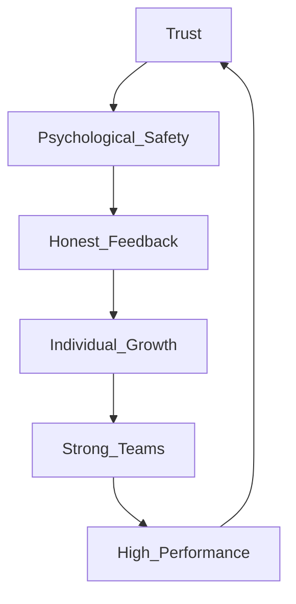
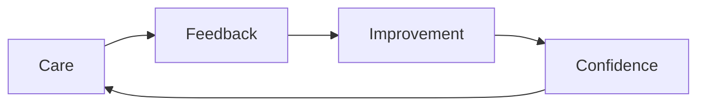

# Trillion Dollar Coach
Authors: Eric Schmidt, Jonathan Rosenberg, Alan Eagle
Category: Leadership, Management, Organizational Culture

---

## 1. Executive Summary

Trillion Dollar Coach documents the leadership philosophy of Bill Campbell, an executive coach who played a formative role in shaping leaders at companies such as Google, Apple, and Intuit. The book presents leadership as a discipline grounded in trust, empathy, and coaching, rather than authority or command‑and‑control management.

The central argument is that long‑term organizational success is driven by leaders who invest deeply in people and teams. Campbell’s approach shows that caring personally, giving candid feedback, and building strong teams are not soft practices but strategic levers that enable innovation, faster execution, and durable business value.

---

## 2. Key Concepts

### Coaching Over Managing
Leaders should operate as coaches, helping individuals grow, think clearly, and make better decisions rather than directing every action. Coaching focuses on development, not control.

### Trust as the Foundation
Trust enables honest communication, productive disagreement, and rapid decision‑making. Without trust, organizations become slow, political, and risk‑averse.

### Care Personally, Challenge Directly
Effective leadership requires genuine personal care combined with high performance standards. Care creates safety; challenge drives excellence.

### Team First, Individual Second
Sustained success comes from strong teams rather than individual stars. Recruiting, rewards, and decision‑making should prioritize team effectiveness.

### One‑on‑One Leadership
Consistent one‑on‑one meetings allow leaders to understand context, deliver personalized feedback, and support continuous growth.

---

## 3. Deep Study Notes

Bill Campbell’s leadership philosophy functions as an integrated system rather than isolated behaviors. Trust creates psychological safety, which enables honest feedback. Feedback accelerates growth, growth strengthens teams, and strong teams sustain performance, reinforcing trust.

A central assumption of the model is that people want to do meaningful work and perform well. Most performance failures are seen as systemic issues rather than individual shortcomings. Authority is considered less effective than influence because influence scales through relationships.

The implications of this model include faster learning cycles, reduced internal politics, stronger succession pipelines, and organizations capable of long‑term adaptation.

---

## 4. Key Takeaways

- Leadership is fundamentally about coaching
- Trust accelerates execution and innovation
- Empathy and accountability must coexist
- Teams outperform individuals consistently
- Direct feedback is an act of respect
- Leadership impact is measured by people developed

---

## 5. Organization of the Book

The book is organized around leadership principles illustrated through real experiences from Bill Campbell’s coaching career. Each principle is introduced through a story, reinforced with examples from senior leaders, and translated into practical guidance. This structure emphasizes that the principles are repeatable, durable, and applicable across industries and roles.

---

## 6. Chapter‑Wise Breakdown

### Chapter 1: Foundations of the Coach
- Bill Campbell’s early life and football coaching background
- Influence of sports coaching on leadership style
- Formation of core coaching values

### Chapter 2: Coaching at the Top
- Coaching CEOs and founders
- Importance of humility in senior leadership
- Leaders benefiting from coaching relationships

### Chapter 3: Building Trust
- Trust as infrastructure for performance
- Encouraging open disagreement
- Relationships enabling faster decisions

### Chapter 4: Caring Personally
- Knowing people beyond job roles
- Emotional investment in people
- Loyalty and engagement as outcomes

### Chapter 5: Challenging Directly
- Delivering honest feedback respectfully
- Avoiding false kindness
- Maintaining high performance standards

### Chapter 6: Team Before Individual
- Designing organizations for collaboration
- Reducing internal competition
- Incentivizing collective success

### Chapter 7: One‑on‑One Coaching
- Regular coaching cadence
- Personalized development paths
- Long‑term leadership growth

### Chapter 8: Legacy and Succession
- Measuring leadership impact over time
- Developing future leaders
- Leaving organizations stronger

---
